# EviTriage-QL

**Evidence-Grounded LLM-Agent Triage for CodeQL Alerts**  
基于 CodeQL 路径证据与大模型 Agent 的可审计漏洞告警二次筛选系统

> Current release: **v0.2.0**, adding fail-closed environment,
> TPM2/systemd-creds, and pass/GPG credential providers to the bounded Gate G
> research release. A source-distribution clean-room
> install passes the full check/demo path, release artifacts are hash-closed
> with a CycloneDX SBOM, and a fresh pinned CodeQL smoke passes. The six-case
> matrix and its reviewed JSONL/HTML/manifest/test summaries are included in
> that checksum closure. This release does not claim a second-host
> reproduction, artifact signature, model-quality benchmark, or production
> readiness.
> The checked-in code supports strict local project configuration, managed source
> snapshots and workspaces, a real CodeQL command runner, existing-SARIF ingest,
> deterministic SARIF 2.1.0 normalization, bounded Level 0/1 Java context, an
> artifact-addressed evidence registry, and run-scoped audit artifacts. The
> offline Golden SARIF path is tested without Java or CodeQL. A pinned Java
> 17/CodeQL 2.26.1 scan of the original Socket-based CWE-22 case produced one
> `java/path-injection` result with an eight-step path and reached
> `CONTEXT_READY` on 2026-07-22. That is real query/pipeline evidence, not a
> vulnerability verdict or a substitute for clean-room reproduction. A fresh
> 2026-07-23 scan of the self-contained six-case Maven project produced four
> real query results and also reached `CONTEXT_READY`; it is deliberately
> separate from the synthetic six-result decision matrix. A new
> offline-only Gate D path provides strict Fake/Replay structured model
> adapters, bounded Analyst/Rebuttal/Judge sequencing, evidence-closed Claims,
> conservative TP/FP/NMC policy, a `triage` CLI, durable Agent states, and
> registered decision artifacts. Successful triage also registers strict
> per-alert JSONL and escaped HTML reports before finalization, and accepts
> either an existing SARIF artifact or a same-run CodeQL scan. The default
> `make demo` path binds six checked-in Java microcases, Golden SARIF, a
> strict identity-bound synthetic evidence supplement, the offline Replay
> profile, and eighteen SHA-256-addressed responses into one deterministic no-key
> workflow that produces CWE-22 TP/FP/NMC, CWE-78 TP/FP, and prompt-injection
> safety evidence. These are
> synthetic workflow/policy fixtures, not accuracy evidence. An opt-in
> DeepSeek V4-Pro/Flash adapter is
> restricted to DeepSeek's official HTTPS endpoint and an explicit remote-data
> policy. Acceptance tests use a simulated endpoint. A separately authorized
> 2026-07-23 live smoke completed three structured calls and reached `JUDGED`
> for one synthetic fixture; it is provider-path evidence, not a quality
> benchmark.

## Problem

CodeQL can identify many potentially security-relevant data flows, but a human
still has to decide whether each path is feasible and exploitable. The complete
EviTriage-QL design will preserve CodeQL's source-to-sink facts, attach every
claim to stable evidence, and use a bounded Analyst/Rebuttal/Judge workflow to
produce one of three auditable outcomes: true positive (`TP`), false positive
(`FP`), or needs more context (`NMC`). It will never automatically dismiss an
upstream alert.

Gate B establishes the two input branches. Gate C consumes their shared output:
a real
`scan` and an operator-supplied `ingest-sarif` both preserve and hash their raw
SARIF, enter the same normalizer, and then use the same context/evidence path.
This keeps offline reproduction useful without presenting Golden data as a real
CodeQL result.

## Gate C/D pipeline and Gate E offline reports

```mermaid
flowchart LR
    U[Trusted operator] --> C{CLI}
    C --> V[ProjectSpec validation]
    V --> W[Managed source snapshot and build copy]
    C --> I[ingest-sarif / normalize]
    W --> S[scan]
    S --> R[CodeQLRunner]
    R -->|real tool output| RAW[Preserved raw SARIF artifact]
    I -->|operator input copy| RAW
    RAW --> N[Shared SARIF 2.1.0 normalizer]
    N --> A[Normalized AlertBundle]
    A --> X[Level 0/1 SliceArtifact per alert]
    X --> E[Evidence Registry + DOT + source map]
    G[Trusted identity-bound evidence supplement] --> E
    E --> T[Bounded Analyst → Rebuttal → Judge]
    F[FakeLLM / ReplayLLM] --> T
    T --> P[Deterministic TP / FP / NMC policy]
    P --> D[Strict TriageResult + stage artifacts]
    D --> Q[Strict JSONL + escaped HTML report]
    Q --> J[Run manifest + append-only event log at JUDGED]
```



The detailed boundaries and trust assumptions are documented in
[`docs/architecture.md`](docs/architecture.md). The foundation, input
convergence, and context/evidence decisions are recorded in
[`ADR 0001`](docs/adr/0001-initial-architecture.md) and
[`ADR 0002`](docs/adr/0002-gate-b-input-convergence.md),
[`ADR 0003`](docs/adr/0003-gate-c-context-evidence.md), and
[`ADR 0004`](docs/adr/0004-gate-c-extra-query-positive-benchmark.md). The
bounded offline triage decision is recorded in
[`ADR 0005`](docs/adr/0005-gate-d-bounded-triage-core.md); the explicit remote
data and credential boundary for DeepSeek is recorded in
[`ADR 0006`](docs/adr/0006-deepseek-v4-opt-in-provider.md), with multi-provider
selection in
[`ADR 0013`](docs/adr/0013-deepseek-multi-credential-providers.md), and the first
offline reporting slice in
[`ADR 0007`](docs/adr/0007-gate-e-offline-reports.md). The first fixed offline
demo bundle is recorded in [`ADR 0008`](docs/adr/0008-gate-e-offline-demo.md),
and the three-label evidence/scan closure in
[`ADR 0009`](docs/adr/0009-gate-e-three-label-and-scan-closure.md).

## Five-minute offline quickstart

Prerequisites for the tested Golden SARIF path:

- Python 3.12;
- [`uv 0.8.3`](https://docs.astral.sh/uv/) installed in a persistent location
  and available on `PATH` in a fresh login shell;
- GNU Make (or a compatible `make`).

The executable `tool.uv.required-version` gate in `pyproject.toml` rejects a
different uv version. A temporary bootstrap below `/tmp` is useful for recovery
but is not a completed development-environment installation. Verify the
environment before synchronization:

```bash
command -v uv
uv --version  # expected: uv 0.8.3
```

Java, Maven, CodeQL, and API keys are not required for this Golden path. Once
the locked Python dependencies are available, the ingest command itself makes
no network request; a first `uv sync` may still need an existing package cache
or package-index access. From the repository root:

```bash
uv sync --all-extras
make check

# Complete offline TP/FP/NMC demo: no Java, CodeQL, API key, or real model.
make demo

uv run evitriage project validate \
  --config configs/projects/example-local.yaml \
  --json

uv run evitriage ingest-sarif \
  --project-config configs/projects/example-local.yaml \
  --sarif tests/fixtures/sarif/single-path.sarif \
  --json

uv run evitriage doctor --json
```

`make demo` emits one machine-readable `TriageRunSummary` for six alerts. Its
`artifact_run_root` contains the preserved SARIF, normalized alerts, context,
evidence, three Agent stages, `reports/decisions.jsonl`, `reports/index.html`,
the append-only workflow event log, and the final run manifest. It uses only
the fixed synthetic Replay bundle under
`tests/fixtures/replay-bundles/gate-e-three-label-v0.1` and the strictly bound
supplement under `tests/fixtures/evidence/`; changing a prompt, response schema,
profile, source, SARIF, supplement, or request identity produces an explicit
failure. The three-TP/two-FP/one-NMC output is a reproducibility and policy
fixture, not a model-quality or vulnerability-accuracy claim.

## Gate G release artifact and clean-room path

After `make check` and `make demo` pass, build and independently verify the
release package closure:

```bash
make release-artifacts
make release-verify
```

The default `dist/release/0.2.0/` directory contains the wheel, source
distribution, a hash-bearing all-extras lock export, a CycloneDX 1.5 SBOM, the
six-case matrix summary, reviewed example JSONL/HTML and its run manifest,
machine-readable full/security test summaries, a strict release manifest, and
`SHA256SUMS`. `make release-artifacts` executes the full and security pytest
suites plus a fresh six-case demo before assembly. The builder fails on version
drift, failed test summaries, mismatched case/report identities, unknown/stale
files, symlinks, unsafe names, or artifact tampering. It does not create a tag,
publish, sign, or turn the separate real-CodeQL smoke into a model verdict.

The full source-distribution reinstall procedure and real-tool smoke boundary
are in [`docs/reproducibility.md`](docs/reproducibility.md). The v0.2.0 scope,
evidence, artifacts, and interpretation limits are in
[`docs/releases/v0.2.0.md`](docs/releases/v0.2.0.md).

`ingest-sarif` creates a managed source snapshot and a distinct run directory,
copies the exact input bytes to `input/source.sarif`, records their SHA-256,
and writes `normalized/alerts.json`, one `context/slices/*.json` per alert,
`context/index.json`, `evidence/registry.json`, `evidence/graph.dot`, and an
escaped `context/source-map.html`, plus the resolved ProjectSpec/workspace
descriptor and audit files. Before finalizing,
the journal reopens every registered artifact, verifies its size and SHA-256,
then makes the artifact and audit files owner-read-only (`0400`). The
`normalize` command accepts the same arguments and deliberately exercises the
same normalizer as a separate CLI operation:

```bash
uv run evitriage normalize \
  --project-config configs/projects/example-local.yaml \
  --sarif tests/fixtures/sarif/multi-path.sarif \
  --json
```

Both commands are read-only with respect to the configured fixture source.
Runtime databases, workspaces, and artifacts are deliberately ignored by Git.
For a local source outside this checkout, the trusted operator must explicitly
repeat `--allowed-source-root /canonical/root`; a ProjectSpec cannot widen its
own filesystem permissions.

Gate D consumes an operator-controlled, request-hash-addressed Replay cache:

```bash
uv run evitriage triage \
  --project-config configs/projects/example-local.yaml \
  --sarif tests/fixtures/sarif/single-path.sarif \
  --llm-profile configs/llm/replay-v0.1.yaml \
  --replay-cache /trusted/read-only/replay-cache \
  --json
```

For a scan and downstream triage in one fresh run, use exactly `--scan` instead
of `--sarif`:

```bash
uv run evitriage triage \
  --project-config configs/projects/example-local.yaml \
  --scan \
  --llm-profile configs/llm/replay-v0.1.yaml \
  --replay-cache /trusted/read-only/replay-cache \
  --json
```

The repository ships only fixed synthetic demo responses, not a general cache
writer. Every required `<request-sha256>.json` entry must already exist and
satisfy the strict role schema; a missing entry creates an auditable
`MODEL_FAILED` run rather than falling back to a network provider. A trusted
evidence supplement can be supplied with `--evidence-supplement`; its project,
snapshot, raw-SARIF, and exact result-occurrence identities must match, and it
adds assertions only—it cannot set Claims or a desired label.

On success, the same finalized run contains
`reports/decisions.jsonl` (one strict `AlertReport` per normalized alert) and
`reports/index.html` (a self-contained audit view). Both are registered in the
manifest with role `report`, reverified by SHA-256, and made owner-read-only.
The HTML view escapes untrusted source/SARIF/model text and explicitly records
that confidence is uncalibrated, verification was not performed, and no alert
was automatically dismissed. JSONL can include bounded source excerpts and
must be protected like the analyzed source tree.

### DeepSeek V4: multi-provider API-key handoff

The checked-in DeepSeek profile selects `deepseek-v4-pro`; the alternative
official model ID `deepseek-v4-flash` is also accepted. The adapter has no
configurable URL: it connects directly to `api.deepseek.com:443`, posts only to
`/chat/completions`, requests JSON Output, disables thinking/tool calls, and
validates the result through the same evidence boundary as Replay.
[The LLM invocation and credential-flow design](docs/llm-invocation-and-credential-flow.md)
documents the complete triage path and the implemented WSL/Linux
multi-provider credential architecture.
[DeepSeek's official API documentation](https://api-docs.deepseek.com/) is the
source of the endpoint and current V4 model identifiers.

Do **not** send the API key in chat and do not put it in a command argument,
YAML, `.env`, shell script, or Git file. A key already sent through chat must be
revoked before storage because its prior copies cannot be made secret again.
Credential selection is separate from model selection:

- `environment` reads only this process's `DEEPSEEK_API_KEY` and never
  persists it;
- `systemd-creds` retains the fixed TPM2-bound Linux ciphertext path;
- `pass` reads the fixed `evitriage/deepseek-api-key` password-store entry
  through GPG;
- `auto` tries `environment → systemd-creds → pass`.

Explicit selection never falls back. Auto skips only an unavailable provider:
if a selected environment value is malformed, a systemd ciphertext cannot be
decrypted, or an installed pass entry fails GPG decryption, triage stops rather
than trying another credential.

On a Linux host with TPM2 and systemd, use the repository-external encrypted
credential store. The operator must be able to access `/dev/tpmrm0`; on this
host that requires one administrator action followed by a full logout/login:

```bash
sudo usermod -aG tss liyitao
```

After starting a new login session, enter the newly rotated key once through a
hidden prompt and verify only its non-secret status:

```bash
uv run evitriage credentials set-deepseek --provider systemd-creds
uv run evitriage credentials status --json
```

The encrypted blob is stored outside the checkout at
`~/.local/share/evitriage/credentials/evitriage-deepseek-api-key.cred`, with a
private `0700` directory and `0600` file. `systemd-creds` encrypts it with TPM2;
`triage --credential-provider systemd-creds` decrypts it through an in-memory
pipe on each run. No plaintext credential file is created. Use `--replace` only
when rotating an existing encrypted credential.

WSL normally lacks a usable TPM2/systemd-creds path. For persistent WSL or
native-Linux storage, install standard `pass` and GPG, initialize the password
store with a **passphrase-protected** GPG private key, and then enroll through
the hidden double prompt:

```bash
pass init <your-gpg-key-id>  # one-time pass/GPG setup outside EviTriage
uv run evitriage credentials set-deepseek --provider pass

uv run evitriage triage \
  --project-config configs/projects/example-local-deepseek-v4.yaml \
  --sarif tests/fixtures/sarif/single-path.sarif \
  --llm-profile configs/llm/deepseek-v4-pro.yaml \
  --credential-provider pass \
  --json
```

EviTriage fixes `PASSWORD_STORE_DIR` to the real operator home's
`~/.password-store`, disables pass extensions, validates the `pass` executable,
and sends the key to `pass insert` only over standard input. GPG-agent may cache
the unlocked private-key state: this improves usability but means same-user
processes can potentially use the agent until its cache expires. Configure a
short cache TTL appropriate to the host and lock or terminate the agent when
the session ends. Secret Service/Python keyring is intentionally not the
default because a desktop D-Bus session and unlocked keyring are unreliable
assumptions for WSL, CI, SSH, and other headless environments.

For an ephemeral run, or on a host without the encrypted store, use this
one-time hidden environment prompt instead:

```bash
(
  trap 'unset DEEPSEEK_API_KEY' EXIT
  read -rsp 'DeepSeek API Key: ' DEEPSEEK_API_KEY
  printf '\n'
  export DEEPSEEK_API_KEY

  uv run evitriage triage \
    --project-config configs/projects/example-local-deepseek-v4.yaml \
    --sarif tests/fixtures/sarif/single-path.sarif \
    --llm-profile configs/llm/deepseek-v4-pro.yaml \
    --credential-provider environment \
    --json
)
```

In every backend, plaintext is used only to construct the HTTPS
`Authorization: Bearer` header. It is not copied into model messages,
request/response artifacts, manifests, child-process environments, or
structured errors. Credential protection covers only the API key: evidence
items and source excerpts **are** still sent to DeepSeek when both trusted
policies declare `remote_llm_allowed`.

There is no meaningful claim of “absolute security”: the key necessarily
exists briefly in process memory (and, for `environment`, the process
environment) and is received by the provider. TPM2 does not protect against an
authorized same-user process; pass/GPG does not protect an already unlocked
gpg-agent session. For higher-assurance deployments, use a dedicated execution
account and an OS/cloud secret manager. The repository ignores `.env`, key,
secret, password-store, response, workspace, and artifact files; `make check`
additionally fails if commit-eligible files match credential patterns.
Run the guard directly with:

```bash
uv run python -m evitriage.secret_scan
```

Run the directly selectable Gate F attack-class regression suite with:

```bash
make security-test
```

This offline subset covers prompt injection containment, malicious SARIF URIs,
path/symlink escape, HTML escaping, shell metacharacter quoting, and secret
redaction. The authoritative quality/coverage gate remains `make check`.

Run an individual test while developing with, for example:

```bash
uv run pytest tests/unit/test_sarif_normalizer.py -q
```

Use `uv run pytest --collect-only -q` to discover the exact test names present
in the current checkout.

## Implemented Gate B/C outputs and Gate D triage

The two example ProjectSpecs select different original synthetic Java 17
fixtures through one `ProjectRegistry`. Their build plans invoke only the
checked-in Apache Maven Wrapper 3.3.4 launcher and declare Maven 3.9.9; bare
host `mvn`, Gradle, explicit commands, shells, and inline interpreters are
rejected. Local acquisition is copy-only: each run builds from an isolated
writable copy of a content-addressed read-only snapshot, never the original
source directory.

The SARIF boundary currently supports:

- SARIF 2.1.0 runs, rules, results, primary/additional/related locations,
  artifacts, URI bases, `codeFlows`, fingerprints, and partial fingerprints;
- single-path, multi-path, pathless, duplicate-result, missing-snippet,
  multi-run, and Windows-URI inputs;
- occurrence-preserving path order and stable alert/path SHA-256 identities;
- an exact raw reference `(raw SARIF SHA-256, run index, result index)` on every
  normalized alert;
- rejection of malformed coordinates, duplicate JSON keys, traversal, remote
  or UNC source URIs, symlink escapes, and missing/unsupported `columnKind` on
  non-empty result runs.

Snapshot binding here is a path-containment rule, not a source-revision proof.
For existing SARIF, the operator must select the corresponding source revision;
when a referenced regular file exists, Gate B independently computes its
SHA-256 and rejects a conflicting SARIF assertion. A missing file remains
allowed with normalized `artifact_sha256=null`. Coordinates are validated for
positive/order semantics; Gate C checks coordinates against a safely opened
regular UTF-8 file before including source, using the run-declared UTF-16-code-
unit or Unicode-code-point measurement. A missing, binary, oversized, or out-
of-bounds source remains an explicit `partial` omission rather than an invented
excerpt. The primary Golden SARIF path, lines, snippet, and declared hash match
the checked-in `PathReader.java` fixture.

Successful input runs end at `CONTEXT_READY`. `path_function_slice` selects the
smallest lexically identified Java callable for primary/additional/related and
source/sink/path locations; `fixed_window` is also executable. The 24,000-token
estimate is a deterministic byte-based budget, and over-budget ranges are
recorded as omissions. `adaptive_slice` remains explicitly unavailable.
Evidence items cite only registered normalized/slice artifact hashes;
relationships and Claim contracts reject dangling evidence IDs. Generated
claims and vulnerability classifications are not produced by these CLI input
runs. The source-map HTML is escaped navigation, not a verdict or Gate E report.

Gate C-Extra completed its bounded acceptance follow-up with real run
`20260721T201029897333Z-849cee21ce99`: the original Socket-based CWE-22 case
produced one CodeQL `java/path-injection` result, one complete eight-step path,
one complete `readRequestedFile` slice, four evidence items, and zero claims at
`CONTEXT_READY`. Its Golden equivalent could not satisfy this gate. See ADR
0004 and the dated progress log for the frozen boundary and artifact hashes.

The bounded Gate D path adds:

- strict `LLMProfile`, Analyst, Rebuttal, Judge, `FinalDecision`, and
  `TriageResult` contracts with generated JSON Schemas;
- ordered Fake/Replay structured calls, canonical request hashes, a maximum of
  one schema/evidence repair per role, six calls per alert, and bounded Replay
  cache reads with no symlink following;
- exact alert-occurrence evidence validation and code-assigned content-derived
  Claim IDs;
- deterministic gates that require matching source-control, data-flow, and
  sink-semantics evidence (or decisive successful verification) for TP,
  decisive Rebuttal evidence for FP, and downgrade conflicts, unknowns, missing
  critical evidence, or weaker cases to NMC; `auto_dismiss` is always false;
- prompt boundaries that keep repository/SARIF text inside
  `untrusted_code_data` and explicitly deny instructions or tool permissions
  found in that data;
- deterministic credential-pattern redaction before canonical request hashing
  and every model/provider boundary, while retaining exact local evidence for
  audit.

The `triage` command requires exactly one of an existing `--sarif` input or a
real `--scan`, allocates a fresh run, reuses the shared normalization/context/
evidence implementation, and continues through `ANALYZED`, `REBUTTED`, and
`JUDGED`. It persists `triage/analyst.json`,
`triage/rebuttal.json`, and `triage/judged.json`, records non-secret
prompt/request/response hashes plus profile/model identity, revalidates all
registered artifact hashes, and finalizes them owner-read-only. Equivalent
source/SARIF input receives a stable `analysis_identity` so Replay request
hashes do not depend on the fresh operational `run_id`.

Existing finalized Gate C runs are not reopened or relabelled. The repository
includes fixed synthetic, SHA-256-inventoried Replay bundles, including the
default six-case v0.1 `make demo`. Its identity-bound supplement makes
the synthetic test oracle explicit; binding and hashing do not independently
prove the asserted evidence true. A general cache writer/producer attestation,
triage continuation by prior `run_id`, and a standalone `report --run-id`
command remain unimplemented. The DeepSeek
adapter has simulated HTTP/CLI coverage plus one separately authorized live
smoke recorded in the dated progress log. Run
`20260722T174132749958Z-8fce5d0ab3f9` used the TPM2 credential path, accepted
all three role responses, and conservatively finalized one synthetic alert as
`NMC` with `auto_dismiss=false`. That single run verifies the credential,
provider, strict-response, and decision path at that time; token usage, cost,
repeatability, rate-limit behavior, and model quality remain unmeasured.

The Gate A commands remain available:

- `project validate` strictly validates and resolves a ProjectSpec;
- `doctor` reports Python, uv, SQLite, managed-root, Java, `javac`, and CodeQL
  status without inventing unavailable tools;
- `db migrate` creates or upgrades the minimal local SQLite schema;
- `WorkspaceManager` allocates and prepares source snapshots and isolated
  writable paths.

## Running a real CodeQL scan

CodeQL and a JDK are **not installed by this project**. A real Gate B scan
requires all of the following in the controlled execution environment:

- CodeQL CLI `2.26.1` on `PATH`, matching the ProjectSpec pin;
- matching `java` and `javac` executables from the same configured JDK (JDK 17
  for the checked-in examples);
- the declared Maven 3.9.9 distribution already available in the Maven Wrapper
  cache when using the checked-in offline build command.

The Maven Wrapper launcher is checked in, but its first bootstrap may otherwise
download Maven. Populate and verify that cache in a separately controlled step;
the configured target build itself passes `--offline`. The ProjectSpec/wrapper
properties declare the Maven distribution and checksum; the Gate B runner does
not independently attest an already cached Maven binary or observe its actual
version. It does validate that wrapper properties use a credential-free HTTPS
URL for one exact Apache Maven release and contain a lowercase distribution
SHA-256. Optional CodeQL query/model packs must use exact
`scope/name@x.y.z` pins.

Confirm the external installation, then invoke the same project configuration:

```bash
codeql version --format=terse
java -version
javac -version

uv run evitriage scan \
  --project-config configs/projects/example-local.yaml \
  --json
```

The runner validates its managed paths and wrapper plan, invokes external tools
as argument vectors with `shell=False`, passes an explicit non-secret environment
allowlist, applies timeouts, and preserves command metadata plus bounded,
redacted stdout/stderr artifacts. A missing tool, version mismatch, timeout,
non-zero exit, or unsafe artifact is a structured failed run, never a synthetic
success. Failed runs persist a redacted `metadata/error.json`, link its hash from
the terminal event, and register any bounded CodeQL command/log artifacts that
were produced before failure. Golden SARIF fixtures are original test data and
are not evidence that CodeQL analyzed either Java fixture.

A successful local smoke is recorded as run
`20260721T114113190209Z-8d9afd2ef3b7`: CodeQL database creation and
`java-security-extended.qls` analysis both exited 0, the run reached
`NORMALIZED`, and the preserved SARIF SHA-256 is
`f6ba2d5bacc5bf6ca88e9a66063a2bff9579cddcb0e0176d40c3d4185ded62c1`.
Its 120 rule descriptors and zero results prove that the fixture completed the
real tool path; they do not prove that other code is vulnerability-free. The
dated evidence log also retains the earlier missing-tool and invalid-suite
failures instead of rewriting that history.

## Reproducibility

The reproducible offline baseline is:

```bash
uv sync --all-extras
make check
uv run evitriage doctor --json
uv run evitriage ingest-sarif \
  --project-config configs/projects/example-local.yaml \
  --sarif tests/fixtures/sarif/single-path.sarif \
  --json
```

Keep `uv.lock` and the generated JSON Schemas committed. Do not edit resolved
configuration or source snapshots after a run starts, and retain the manifest,
event log, raw SARIF, normalized bundle, and their SHA-256 identities with
research artifacts. See the dated evidence log in
[`docs/progress/2026-07-27-v0.1.md`](docs/progress/2026-07-27-v0.1.md).

## Limitations, safety, and ethics

The current boundary is enumerated in
[`KNOWN_LIMITATIONS.md`](KNOWN_LIMITATIONS.md). Model-platform providers other
than the narrow DeepSeek V4 adapter, a general Replay cache producer, prior-run
continuation, a standalone report command, and independently verified
production evidence supplements remain unavailable.
Remote Git acquisition, Gradle, adaptive context, and automatic verification
are also outside this gate.

Target repositories, source comments, build files, and SARIF documents are
untrusted data. They must not select model endpoints, supply secrets, expand
tool permissions, or become shell commands. A real `scan` executes a target
build and the current managed workspace is not a complete operating-system
sandbox; the current runner is suitable only for trusted fixtures/repositories
unless an external least-privilege network/resource/process sandbox is supplied.
Do not use this research software to attack systems without explicit
authorization or publish sensitive vulnerability details before coordinated
disclosure. See [`SECURITY.md`](SECURITY.md) for reporting guidance.

## License and citation

EviTriage-QL is distributed under the [Apache License 2.0](LICENSE). That license
covers this repository's own code and documentation only; target repositories,
CodeQL, Maven, fixtures derived from third parties, and datasets retain their
own licenses. Citation metadata is available in [`CITATION.cff`](CITATION.cff).
