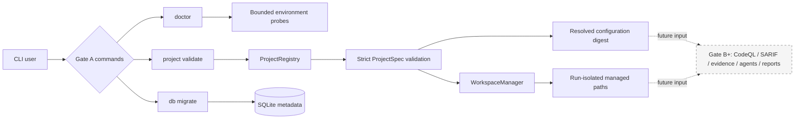

# EviTriage-QL

**Evidence-Grounded LLM-Agent Triage for CodeQL Alerts**  
基于 CodeQL 路径证据与大模型 Agent 的可审计漏洞告警二次筛选系统

> Current implementation status: **Gate A (engineering foundation)**. Project
> configuration, managed workspaces, environment diagnostics, minimal SQLite
> storage, and their tests are in scope. CodeQL scanning, SARIF normalization,
> context extraction, LLM agents, and TP/FP/NMC reports are later gates and are
> not presented as available here.

## Problem

CodeQL can identify many potentially security-relevant data flows, but a human
still has to decide whether each path is feasible and exploitable. The complete
EviTriage-QL design will preserve CodeQL's source-to-sink facts, attach every
claim to stable evidence, and use a bounded Analyst/Rebuttal/Judge workflow to
produce one of three auditable outcomes: true positive (`TP`), false positive
(`FP`), or needs more context (`NMC`). It will never automatically dismiss an
upstream alert.

Gate A establishes the reproducible and security-sensitive substrate for that
pipeline: a target is supplied through a strict `ProjectSpec`, validated by the
same registry code regardless of repository, and assigned isolated managed
paths without modifying the original source directory.

## Gate A architecture



The detailed component boundaries and trust assumptions are documented in
[`docs/architecture.md`](docs/architecture.md). The initial choices are recorded
in [`docs/adr/0001-initial-architecture.md`](docs/adr/0001-initial-architecture.md).

## Five-minute quickstart

Prerequisites:

- Python 3.12;
- [`uv`](https://docs.astral.sh/uv/) on `PATH`;
- GNU Make (or a compatible `make`).

From the repository root:

```bash
uv sync --all-extras
make check

uv run evitriage project validate \
  --config configs/projects/example-local.yaml \
  --json

uv run evitriage project validate \
  --config configs/projects/example-local-command.yaml \
  --json

uv run evitriage db migrate --json
uv run evitriage doctor --json
```

The two example configurations point to different local Java fixtures but pass
through the same `ProjectRegistry` and workspace code. Validation is read-only
with respect to those fixture directories. Runtime databases, workspaces, and
artifacts are deliberately ignored by Git.

For a local source outside this checkout, the trusted operator must explicitly
repeat `--allowed-source-root /canonical/root`; a ProjectSpec cannot widen its
own filesystem permissions.

Run an individual test while developing with, for example:

```bash
uv run pytest tests/unit/test_project_spec.py -q
```

Use `uv run pytest --collect-only -q` to discover the exact test names present
in the current checkout.

## Micro example and Gate A outputs

`configs/projects/example-local.yaml` is a small declarative example of the
only supported Gate A source mode: a local directory under an explicitly
allowed root. It contains build metadata as an argument vector, never as a
shell program. The companion `example-local-command.yaml` exercises a distinct
fixture/configuration through the same validation path.

At this gate:

- `project validate` checks syntax and semantic constraints and emits a
  machine-readable result when `--json` is used;
- `doctor` validates the versioned system configuration and reports Python, uv,
  SQLite, managed-root writability, Java, and CodeQL without inventing
  unavailable tools;
- `db migrate` creates or upgrades the minimal local SQLite schema;
- `WorkspaceManager` allocates paths below configured workspace/artifact roots;
- errors are structured and commands use meaningful exit codes.

No alert label, confidence, evidence graph, SARIF normalization, or HTML report
is produced in Gate A. Those outputs become valid only after the corresponding
later gates have executable tests.

## Local CodeQL prerequisites

CodeQL is **not installed by this project** and Gate A does not execute a scan.
For the Gate B smoke run, install the CodeQL CLI separately, place `codeql` on
`PATH`, and use the configured reference version (`2.26.1`). Also provide the JDK
and Maven tooling required by the selected Java project. Confirm the external
installation directly:

```bash
codeql version
java -version
```

`evitriage doctor --json` records whether CodeQL and Java are discoverable. A
missing CodeQL installation must remain an explicit unavailable/failed
condition; golden data used in later offline CI must never masquerade as a real
scan. Review the CodeQL distribution's license and terms independently before
use.

## Reproducibility

The reproducible Gate A baseline is:

```bash
uv sync --all-extras
make check
uv run evitriage doctor --json
```

Keep `uv.lock` committed, do not edit resolved configuration after a run starts,
and retain the emitted configuration digest with research artifacts. Local
source trees are treated as inputs; writable state belongs below the managed
workspace and artifact roots. See the dated evidence log in
[`docs/progress/2026-07-27-v0.1.md`](docs/progress/2026-07-27-v0.1.md).

## Limitations, safety, and ethics

The current boundary is enumerated in
[`KNOWN_LIMITATIONS.md`](KNOWN_LIMITATIONS.md). In particular, Gate A does not
support remote Git acquisition, Gradle, CodeQL execution, SARIF ingest, LLM
providers, automatic verification, or alert disposition.

Target repositories, source comments, build files, and future SARIF input are
untrusted data. They must not select model endpoints, supply secrets, expand
tool permissions, or become shell commands. Do not use this research software
to attack systems without explicit authorization, and do not publish sensitive
vulnerability details before coordinated disclosure. See
[`SECURITY.md`](SECURITY.md) for reporting guidance.

## License and citation

EviTriage-QL is distributed under the [Apache License 2.0](LICENSE). That license
covers this repository's own code and documentation only; target repositories,
CodeQL, fixtures derived from third parties, and datasets retain their own
licenses. Citation metadata is available in [`CITATION.cff`](CITATION.cff).
