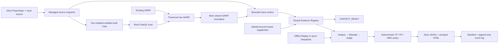

# EviTriage-QL

[English](README.md) | [简体中文](README.zh-CN.md)

**Evidence-grounded, auditable secondary triage for CodeQL alerts.**

EviTriage-QL starts from CodeQL's source-to-sink facts, preserves their
provenance, builds bounded source context and evidence, and runs a constrained
Analyst → Rebuttal → Judge workflow. A deterministic policy then produces one
of three review labels:

- `TP` — the available evidence supports a true positive;
- `FP` — decisive rebuttal evidence supports a false positive;
- `NMC` — more context is needed, so the system refuses to force a binary
  answer.

Every conclusion remains linked to the exact SARIF result occurrence and the
artifacts that support it. `auto_dismiss` is always `false`: EviTriage-QL never
closes an upstream CodeQL alert.

> **Current codebase: v0.2.0 (alpha research infrastructure).** This is a local
> CLI, not a production vulnerability classifier, hosted service, or
> autonomous remediation system. The checked-in offline demo is deterministic
> and synthetic. It demonstrates workflow, policy, and artifact
> reproducibility—not model quality, vulnerability accuracy, or independent
> ground truth.

## What it does

- Accepts either an existing SARIF 2.1.0 artifact or a fresh CodeQL scan.
- Sends both input modes through one strict normalization, context, and
  evidence pipeline.
- Preserves raw SARIF bytes and every alert's exact
  `(SARIF SHA-256, run_index, result_index)` identity without upstream
  deduplication.
- Creates copy-only source snapshots and a separate writable build copy for
  every run. EviTriage-QL's own file adapters treat the original source tree
  as input-only.
- Extracts bounded Level 0/1 Java context with explicit omissions when source
  is missing, unsafe, binary, oversized, changed, out of bounds, or over
  budget.
- Restricts model claims to a closed, artifact-addressed Evidence Registry.
- Supports deterministic offline Replay triage and an explicitly authorized
  DeepSeek path.
- Writes strict JSONL, escaped HTML, stage artifacts, a SHA-256 manifest, and
  an append-only workflow event log.

## Choose a workflow

| Workflow | Additional requirements | Executes target code | Model network | Successful state |
| --- | --- | ---: | ---: | --- |
| `make demo` | Synced Python dependencies | No | No | `JUDGED`, six synthetic decisions |
| `ingest-sarif` / `normalize` | Matching local source and SARIF | No | No | `CONTEXT_READY`, no label |
| `scan` | JDK 17, CodeQL 2.26.1, prepared Maven 3.9.9 distribution/dependency caches | Yes | No | `CONTEXT_READY`, no label |
| `triage --sarif` with Replay | Exact trusted read-only Replay entries | No | No | `JUDGED`, JSONL and HTML |
| `triage --scan` | Real-scan environment plus Replay or authorized DeepSeek | Yes | Provider-dependent | `JUDGED`, JSONL and HTML |
| DeepSeek `triage` | Dual upload-policy opt-in, network, and a secure credential | Input-dependent | Yes | `JUDGED`, JSONL and HTML |

`CONTEXT_READY` means that input, normalization, context, and evidence
processing completed. It is not a `TP`/`FP`/`NMC` verdict. Only a fresh
`triage` run continues through `ANALYZED → REBUTTED → JUDGED`.
The `triage --scan` path has controlled-runner integration coverage, but this
codebase does not claim a fresh real-CodeQL-to-`JUDGED` acceptance artifact.

## Five-minute offline quickstart

The documented acceptance baseline uses:

- Python 3.12; package metadata permits Python `>=3.12,<3.14`;
- exactly [`uv 0.8.3`](https://docs.astral.sh/uv/), installed persistently and
  available on `PATH`;
- GNU Make or a compatible `make`.

From the repository root:

```bash
uv --version  # expected: uv 0.8.3
uv sync --all-extras
uv run evitriage doctor --json
make demo
```

The first `uv sync` may need a package index or a populated cache. Once the
locked dependencies are available, `make demo` uses `uv run --offline` and
does not require Java, CodeQL, an API key, a real model, or a model-service
request.

The demo prints one machine-readable `TriageRunSummary`. A successful result
has:

- `state: "JUDGED"` and `real_codeql: false`;
- six alerts and eighteen Replay calls;
- three `TP`, two `FP`, and one `NMC`;
- an `artifact_run_root` pointing to the complete audit directory.

Open `<artifact_run_root>/reports/index.html` for the self-contained report or
process `<artifact_run_root>/reports/decisions.jsonl` as strict JSONL. These
labels come from fixed Golden SARIF, synthetic evidence, and synthetic Replay
responses. They are a reproducibility fixture, not an accuracy benchmark.

`doctor` returning `status: "ok"` means its required checks passed: the Python
version, an executable `uv`, SQLite, the loadable system config, and writable
managed roots. It may create or permission those roots and writes bounded
probes. It does not verify the uv pin, Make, dependency/cache completeness, or
scan readiness. Java, `javac`, and CodeQL are optional diagnostics there; the
real scan runner checks their versions against the ProjectSpec.

## How it works



The two input branches have different acquisition and tool provenance. Both
allocate an isolated build copy, but only a scan executes it and emits CodeQL
tool logs. Once raw SARIF exists, both branches share the same parser,
normalizer, context builder, Evidence Registry, artifact journal, and—when
`triage` is selected—decision/report path.

Model output is a candidate, not the final authority. Claims must reference
evidence for the exact alert occurrence. The deterministic policy downgrades
conflicts, unknowns, unresolved critical claims, and insufficient support to
`NMC`. An optional evidence supplement is identity-bound and auditable, but
its assertions are still trusted input rather than independently proven facts.

## Connect an existing SARIF artifact

Start from [`configs/projects/example-local.yaml`](configs/projects/example-local.yaml).
For private targets, use a filename such as
`configs/projects/private-my-project.yaml`; that pattern is ignored by Git.
Set `source.path` to the exact local source revision corresponding to the
SARIF.

Validate the ProjectSpec, then ingest:

```bash
uv run evitriage project validate \
  --config configs/projects/private-my-project.yaml \
  --allowed-source-root /absolute/path/to/source \
  --json

uv run evitriage ingest-sarif \
  --project-config configs/projects/private-my-project.yaml \
  --sarif /absolute/path/to/results.sarif \
  --allowed-source-root /absolute/path/to/source \
  --json
```

For source inside this checkout, `--allowed-source-root` can be omitted. A
ProjectSpec cannot grant itself access to an external source root; the trusted
operator must repeat that boundary on each command.

Existing-SARIF ingest never runs Maven or CodeQL. It preserves the exact input
bytes, snapshots the selected source, normalizes every supported result
occurrence, extracts context, and builds the evidence artifacts. If a
referenced regular source file exists, EviTriage-QL hashes it independently
and rejects a conflicting SARIF hash. Missing source stays unknown and partial;
the system does not claim that missing-file coordinates were verified.
The operator still supplies the source/SARIF correspondence: containment and
file-hash checks can detect some conflicts, but cannot prove that the selected
snapshot produced the SARIF.

`normalize` accepts the same `--project-config` and `--sarif` arguments. It is
an explicit operator alias over the same complete path, so it also builds
context/evidence and ends at `CONTEXT_READY`; it is not a normalization-only
shortcut.

## Run a real CodeQL scan

> **A real scan executes the target repository's checked-in Maven Wrapper as
> the current host user.** Managed copies, validated argument vectors, an
> environment allowlist, and timeouts are not an operating-system sandbox.
> Scan only trusted repositories unless you provide an external isolated
> account, VM, or container with filesystem, network, process, CPU, and memory
> controls. Without that isolation, target build code can read or modify files
> accessible to the host account, including material under its home directory
> and a writable original source tree.

EviTriage-QL does not install the external scan toolchain. The checked-in
examples require:

- CodeQL CLI `2.26.1` on `PATH`;
- `java` and `javac` from the same JDK 17;
- an executable, non-symlink, checked-in `./mvnw`;
- the declared Maven 3.9.9 distribution in the Wrapper cache and project
  dependencies in the Maven local repository/cache for the configured
  `--offline` build;
- exact `scope/name@x.y.z` pins for optional query/model packs.

Verify the external tools, then scan:

```bash
codeql version --format=terse
java -version
javac -version

uv run evitriage scan \
  --project-config configs/projects/example-local.yaml \
  --json
```

The runner checks the configured CodeQL/JDK versions and fails structurally on
missing tools, mismatches, timeouts, non-zero exits, unsafe output, or invalid
SARIF. It never substitutes Golden SARIF for a failed real scan. A successful
`scan` reports `real_codeql: true` and ends at `CONTEXT_READY`.

`build.network_policy: disabled` requires Maven's `--offline` flag; it is not
an OS-enforced network namespace. Preparing and attesting the Maven cache is an
external supply-chain responsibility.

## Run Analyst / Rebuttal / Judge triage

For offline Replay:

```bash
uv run evitriage triage \
  --project-config configs/projects/private-my-project.yaml \
  --sarif /absolute/path/to/results.sarif \
  --llm-profile configs/llm/replay-v0.1.yaml \
  --replay-cache /trusted/read-only/replay-cache \
  --allowed-source-root /absolute/path/to/source \
  --json
```

Use exactly one of `--sarif` and `--scan`. Replacing `--sarif ...` with
`--scan` performs a fresh CodeQL scan and continues through reports in that
same new run.

Replay is request-hash addressed: every required
`<canonical-request-sha256>.json` response must already exist and satisfy the
strict role schema. The repository includes only the fixed synthetic demo
bundle, not a general Replay-cache producer for arbitrary projects. A missing
entry creates an auditable `MODEL_FAILED` run and never falls back to a remote
provider.

### Optional DeepSeek provider

The opt-in adapter accepts the two fixed model IDs implemented by this
codebase, `deepseek-v4-pro` and `deepseek-v4-flash`, and fixes the connection to
`api.deepseek.com:443/chat/completions`. Remote triage is allowed only when
both the trusted ProjectSpec and LLM Profile declare
`remote_llm_allowed`.

**Never put an API key in chat, command arguments, YAML, `.env`, shell scripts,
logs, Git, or run artifacts. Revoke a key exposed through chat before enrolling
a replacement.** The implemented credential sources are a one-process
`DEEPSEEK_API_KEY`, TPM2/systemd-creds, and pass/GPG. Enrollment and provider
selection are documented in the
[deployment guide](docs/deployment-guide.md#9-optional-remote-deepseek-triage).

Credential protection covers the key, not the uploaded data. Authorized
evidence and bounded source excerpts are sent to DeepSeek and may be subject to
provider retention, cost, and jurisdiction rules. Pattern redaction is not a
general DLP system.

## Run artifacts and audit trail

After preflight validation succeeds and the pipeline starts, each
`ingest-sarif`, `normalize`, `scan`, or `triage` invocation allocates a fresh
run. A pre-allocation validation failure has no run directory. A successful
triage run has this shape:

```text
artifacts/runs/<run-id>/
├── project-spec.resolved.yaml
├── workflow-events.jsonl
├── run-manifest.json
├── input/source.sarif or codeql/results.sarif
├── normalized/alerts.json
├── context/
│   ├── index.json
│   ├── slices/*.json
│   └── source-map.html
├── evidence/
│   ├── registry.json
│   └── graph.dot
├── triage/
│   ├── analyst.json
│   ├── rebuttal.json
│   └── judged.json
└── reports/
    ├── decisions.jsonl
    └── index.html
```

`workflow-events.jsonl` is the append-only state history.
`run-manifest.json` is the current/final projection, not an append-only
database. Before finalization, the journal reopens every registered artifact,
rechecks its size and SHA-256, and makes artifacts and audit files
owner-read-only (`0400`). Failures after allocation retain structured,
redacted error metadata and any bounded tool artifacts already produced.

Hashes and read-only modes make accidental changes detectable; they are not a
tamper-proof ledger. The filesystem owner or root can still change permissions
and bytes. Archive important runs under independent controls.

Reports can contain bounded source excerpts. HTML escaping prevents active
markup; it is not secret redaction or authorization to publish the content.
Protect JSONL, HTML, SARIF, workspaces, and run artifacts at least as strongly
as the analyzed source.

## Current boundaries

- Only local Java projects can be materialized. Git and dataset source types
  are reserved in the schema, but remote acquisition, dataset adapters, and
  submodule materialization are not implemented.
- Real scanning supports CodeQL `java-kotlin` through a checked-in Maven
  Wrapper only. Gradle, bare Maven, arbitrary build commands, and other
  languages are unavailable.
- The SARIF parser intentionally supports a bounded SARIF 2.1.0 subset; this is
  not a source-free general SARIF viewer.
- Java context uses bounded fixed windows or lexical callable boundaries, not
  compiler AST/CFG semantics, path-feasibility proof, or whole-repository
  analysis. `adaptive_slice` is explicitly unavailable.
- `analysis.target_cwes` is validated and recorded but does not currently
  filter SARIF results.
- There is no automatic verification, calibrated confidence, general Replay
  producer, prior-run continuation, crash recovery, caller-selected run ID,
  standalone `report --run-id`, or cross-run aggregation.
- A minimal SQLite schema and migration command exist, but the current
  workflow does not write or index runs there. Its auditable record is
  file-backed under each run directory.
- No output should be the sole basis for alert dismissal, disclosure, or
  production risk acceptance.

See the detailed Gate G [limitation inventory](KNOWN_LIMITATIONS.md), the
[v0.2.0 extension notes](docs/releases/v0.2.0.md), and the
[security/disclosure process](SECURITY.md). Some linked historical documents
retain v0.1 scope labels; the executable code and package version here are
v0.2.0.

## Evidence is not a claim of accuracy

| Recorded evidence | What it demonstrates | What it does not demonstrate |
| --- | --- | --- |
| Deterministic six-case `make demo` | Offline workflow, policy, report, and artifact reproducibility | Model quality, independent labels, or generalization |
| Pinned real CodeQL smoke runs | The external runner/query/SARIF/context path worked in the recorded environment | Exploitability, a TP/FP/NMC verdict, or arbitrary-project readiness |
| One authorized DeepSeek smoke on a synthetic fixture | Credential, HTTPS provider, strict response, and three-role path worked at that time | Accuracy, cost, retry/rate-limit behavior, or ongoing availability |
| Hash-closed wheel/sdist/SBOM/test/example bundle | Same-host release assembly and integrity verification | Artifact signature, second-host reproduction, or production readiness |

Exact commands, run IDs, hashes, failures, and interpretation limits are kept
in the
[historical delivery evidence log](docs/progress/2026-07-27-v0.1.md), not
repeated as headline product claims.

## Development and release verification

After synchronizing dependencies:

```bash
# Lock, formatting, lint, strict typing, schemas, secret scan, tests,
# and the branch-aware coverage floor.
make check

# Directly selected trust-boundary regressions; the full authority remains check.
make security-test

# Deterministic end-to-end synthetic workflow.
make demo
```

Run a focused test while developing:

```bash
uv run pytest tests/unit/test_sarif_normalizer.py -q
```

Build and independently verify the local release closure:

```bash
make release-artifacts
make release-verify
```

The default `dist/release/0.2.0/` closure contains the wheel, source
distribution, hash-bearing dependency inventory, CycloneDX 1.5 SBOM,
machine-readable test summaries, reviewed demo evidence, a strict release
manifest, and `SHA256SUMS`. These commands do not tag, publish, or sign a
release. See the [reproducibility guide](docs/reproducibility.md).

## Repository map

```text
src/evitriage/     CLI, domain models, pipeline, adapters, policy, reporting
configs/           Strict system, project, and LLM profile examples
schemas/           Generated public JSON Schemas
tests/             Unit, integration, security, fixtures, and Replay bundles
docs/              Requirements, architecture, ADRs, deployment, progress, releases
migrations/        Minimal local SQLite schema
```

The dated project blueprint describes the longer-term research design and
includes capabilities beyond this executable v0.2.0 boundary. Treat the
current CLI help, strict schemas, tests, and known-limitations document as the
guide to what is available now.

## Documentation

- Historical requirements and completion review:
  [project blueprint (Chinese source)](docs/requirements/project-blueprint-2026-07-20.zh-CN.md),
  [Codex build prompt (Chinese source)](docs/requirements/codex-build-prompt-2026-07-20.zh-CN.md),
  and [v0.1 delivery plan (Chinese source)](docs/progress/2026-07-20-v0.1-delivery-plan.zh-CN.md).
  The v0.1 P0/Gate A-G release scope is complete; the broader research
  blueprint is only partially implemented, and the delivery plan is a
  historical baseline rather than a live checklist.
- [Dual-environment stage summary and executable next steps](docs/progress/2026-07-23-stage-summary.md) |
  [双环境阶段总结与可执行计划](docs/progress/2026-07-23-stage-summary.zh-CN.md)
- [Deployment and operations](docs/deployment-guide.md) |
  [部署与运行](docs/deployment-guide.zh-CN.md)
- [Architecture and trust boundaries](docs/architecture.md)
- [Gate G limitation inventory](KNOWN_LIMITATIONS.md) |
  [Gate G 限制清单](KNOWN_LIMITATIONS.zh-CN.md)
- [Security policy](SECURITY.md) | [安全策略](SECURITY.zh-CN.md)
- [Reproducing v0.2.0](docs/reproducibility.md) and
  [v0.2.0 notes](docs/releases/v0.2.0.md)
- [Architecture decisions](docs/adr/) and
  [historical delivery evidence log](docs/progress/2026-07-27-v0.1.md)
- [Contributing](CONTRIBUTING.md) | [参与贡献](CONTRIBUTING.zh-CN.md)

## License and citation

EviTriage-QL is distributed under the [Apache License 2.0](LICENSE). That
license covers this repository's own code and documentation only; target
repositories, CodeQL, Maven, and external datasets retain their own terms.
Citation metadata is available in [`CITATION.cff`](CITATION.cff).
