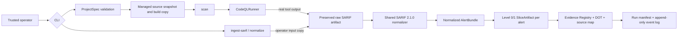

# EviTriage-QL

**Evidence-Grounded LLM-Agent Triage for CodeQL Alerts**  
基于 CodeQL 路径证据与大模型 Agent 的可审计漏洞告警二次筛选系统

> Current implementation status: **Gate C-Extra query-positive readiness**. The
> checked-in code supports strict local project configuration, managed source
> snapshots and workspaces, a real CodeQL command runner, existing-SARIF ingest,
> deterministic SARIF 2.1.0 normalization, bounded Level 0/1 Java context, an
> artifact-addressed evidence registry, and run-scoped audit artifacts. The
> offline Golden SARIF path is tested without Java or CodeQL. A pinned Java
> 17/CodeQL 2.26.1 scan of the original Socket-based CWE-22 case produced one
> `java/path-injection` result with an eight-step path and reached
> `CONTEXT_READY` on 2026-07-22. That is real query/pipeline evidence, not a
> vulnerability verdict or a substitute for clean-room reproduction.
> LLM agents, TP/FP/NMC decisions, and decision reports are not implemented.

## Problem

CodeQL can identify many potentially security-relevant data flows, but a human
still has to decide whether each path is feasible and exploitable. The complete
EviTriage-QL design will preserve CodeQL's source-to-sink facts, attach every
claim to stable evidence, and use a bounded Analyst/Rebuttal/Judge workflow to
produce one of three auditable outcomes: true positive (`TP`), false positive
(`FP`), or needs more context (`NMC`). It will never automatically dismiss an
upstream alert.

Gate B establishes the two input branches. Gate C consumes their shared output:
a real
`scan` and an operator-supplied `ingest-sarif` both preserve and hash their raw
SARIF, enter the same normalizer, and then use the same context/evidence path.
This keeps offline reproduction useful without presenting Golden data as a real
CodeQL result.

## Gate C input-to-evidence architecture



The detailed boundaries and trust assumptions are documented in
[`docs/architecture.md`](docs/architecture.md). The foundation, input
convergence, and context/evidence decisions are recorded in
[`ADR 0001`](docs/adr/0001-initial-architecture.md) and
[`ADR 0002`](docs/adr/0002-gate-b-input-convergence.md),
[`ADR 0003`](docs/adr/0003-gate-c-context-evidence.md), and
[`ADR 0004`](docs/adr/0004-gate-c-extra-query-positive-benchmark.md).

## Five-minute offline quickstart

Prerequisites for the tested Golden SARIF path:

- Python 3.12;
- [`uv 0.8.3`](https://docs.astral.sh/uv/) installed in a persistent location
  and available on `PATH` in a fresh login shell;
- GNU Make (or a compatible `make`).

The executable `tool.uv.required-version` gate in `pyproject.toml` rejects a
different uv version. A temporary bootstrap below `/tmp` is useful for recovery
but is not a completed development-environment installation. Verify the
environment before synchronization:

```bash
command -v uv
uv --version  # expected: uv 0.8.3
```

Java, Maven, CodeQL, and API keys are not required for this Golden path. Once
the locked Python dependencies are available, the ingest command itself makes
no network request; a first `uv sync` may still need an existing package cache
or package-index access. From the repository root:

```bash
uv sync --all-extras
make check

uv run evitriage project validate \
  --config configs/projects/example-local.yaml \
  --json

uv run evitriage ingest-sarif \
  --project-config configs/projects/example-local.yaml \
  --sarif tests/fixtures/sarif/single-path.sarif \
  --json

uv run evitriage doctor --json
```

`ingest-sarif` creates a managed source snapshot and a distinct run directory,
copies the exact input bytes to `input/source.sarif`, records their SHA-256,
and writes `normalized/alerts.json`, one `context/slices/*.json` per alert,
`context/index.json`, `evidence/registry.json`, `evidence/graph.dot`, and an
escaped `context/source-map.html`, plus the resolved ProjectSpec/workspace
descriptor and audit files. Before finalizing,
the journal reopens every registered artifact, verifies its size and SHA-256,
then makes the artifact and audit files owner-read-only (`0400`). The
`normalize` command accepts the same arguments and deliberately exercises the
same normalizer as a separate CLI operation:

```bash
uv run evitriage normalize \
  --project-config configs/projects/example-local.yaml \
  --sarif tests/fixtures/sarif/multi-path.sarif \
  --json
```

Both commands are read-only with respect to the configured fixture source.
Runtime databases, workspaces, and artifacts are deliberately ignored by Git.
For a local source outside this checkout, the trusted operator must explicitly
repeat `--allowed-source-root /canonical/root`; a ProjectSpec cannot widen its
own filesystem permissions.

Run an individual test while developing with, for example:

```bash
uv run pytest tests/unit/test_sarif_normalizer.py -q
```

Use `uv run pytest --collect-only -q` to discover the exact test names present
in the current checkout.

## Implemented Gate B/C outputs

The two example ProjectSpecs select different original synthetic Java 17
fixtures through one `ProjectRegistry`. Their build plans invoke only the
checked-in Apache Maven Wrapper 3.3.4 launcher and declare Maven 3.9.9; bare
host `mvn`, Gradle, explicit commands, shells, and inline interpreters are
rejected. Local acquisition is copy-only: each run builds from an isolated
writable copy of a content-addressed read-only snapshot, never the original
source directory.

The SARIF boundary currently supports:

- SARIF 2.1.0 runs, rules, results, primary/additional/related locations,
  artifacts, URI bases, `codeFlows`, fingerprints, and partial fingerprints;
- single-path, multi-path, pathless, duplicate-result, missing-snippet,
  multi-run, and Windows-URI inputs;
- occurrence-preserving path order and stable alert/path SHA-256 identities;
- an exact raw reference `(raw SARIF SHA-256, run index, result index)` on every
  normalized alert;
- rejection of malformed coordinates, duplicate JSON keys, traversal, remote
  or UNC source URIs, symlink escapes, and missing/unsupported `columnKind` on
  non-empty result runs.

Snapshot binding here is a path-containment rule, not a source-revision proof.
For existing SARIF, the operator must select the corresponding source revision;
when a referenced regular file exists, Gate B independently computes its
SHA-256 and rejects a conflicting SARIF assertion. A missing file remains
allowed with normalized `artifact_sha256=null`. Coordinates are validated for
positive/order semantics; Gate C checks coordinates against a safely opened
regular UTF-8 file before including source, using the run-declared UTF-16-code-
unit or Unicode-code-point measurement. A missing, binary, oversized, or out-
of-bounds source remains an explicit `partial` omission rather than an invented
excerpt. The primary Golden SARIF path, lines, snippet, and declared hash match
the checked-in `PathReader.java` fixture.

Successful input runs end at `CONTEXT_READY`. `path_function_slice` selects the
smallest lexically identified Java callable for primary/additional/related and
source/sink/path locations; `fixed_window` is also executable. The 24,000-token
estimate is a deterministic byte-based budget, and over-budget ranges are
recorded as omissions. `adaptive_slice` remains explicitly unavailable.
Evidence items cite only registered normalized/slice artifact hashes;
relationships and Claim contracts reject dangling evidence IDs. Generated
claims, vulnerability classifications, and decision reports do **not** exist
yet. The source-map HTML is escaped navigation, not a verdict or Gate E report.

Gate C-Extra completed its bounded acceptance follow-up with real run
`20260721T201029897333Z-849cee21ce99`: the original Socket-based CWE-22 case
produced one CodeQL `java/path-injection` result, one complete eight-step path,
one complete `readRequestedFile` slice, four evidence items, and zero claims at
`CONTEXT_READY`. Its Golden equivalent could not satisfy this gate. See ADR
0004 and the dated progress log for the frozen boundary and artifact hashes.

The Gate A commands remain available:

- `project validate` strictly validates and resolves a ProjectSpec;
- `doctor` reports Python, uv, SQLite, managed-root, Java, `javac`, and CodeQL
  status without inventing unavailable tools;
- `db migrate` creates or upgrades the minimal local SQLite schema;
- `WorkspaceManager` allocates and prepares source snapshots and isolated
  writable paths.

## Running a real CodeQL scan

CodeQL and a JDK are **not installed by this project**. A real Gate B scan
requires all of the following in the controlled execution environment:

- CodeQL CLI `2.26.1` on `PATH`, matching the ProjectSpec pin;
- matching `java` and `javac` executables from the same configured JDK (JDK 17
  for the checked-in examples);
- the declared Maven 3.9.9 distribution already available in the Maven Wrapper
  cache when using the checked-in offline build command.

The Maven Wrapper launcher is checked in, but its first bootstrap may otherwise
download Maven. Populate and verify that cache in a separately controlled step;
the configured target build itself passes `--offline`. The ProjectSpec/wrapper
properties declare the Maven distribution and checksum; the Gate B runner does
not independently attest an already cached Maven binary or observe its actual
version. It does validate that wrapper properties use a credential-free HTTPS
URL for one exact Apache Maven release and contain a lowercase distribution
SHA-256. Optional CodeQL query/model packs must use exact
`scope/name@x.y.z` pins.

Confirm the external installation, then invoke the same project configuration:

```bash
codeql version --format=terse
java -version
javac -version

uv run evitriage scan \
  --project-config configs/projects/example-local.yaml \
  --json
```

The runner validates its managed paths and wrapper plan, invokes external tools
as argument vectors with `shell=False`, passes an explicit non-secret environment
allowlist, applies timeouts, and preserves command metadata plus bounded,
redacted stdout/stderr artifacts. A missing tool, version mismatch, timeout,
non-zero exit, or unsafe artifact is a structured failed run, never a synthetic
success. Failed runs persist a redacted `metadata/error.json`, link its hash from
the terminal event, and register any bounded CodeQL command/log artifacts that
were produced before failure. Golden SARIF fixtures are original test data and
are not evidence that CodeQL analyzed either Java fixture.

A successful local smoke is recorded as run
`20260721T114113190209Z-8d9afd2ef3b7`: CodeQL database creation and
`java-security-extended.qls` analysis both exited 0, the run reached
`NORMALIZED`, and the preserved SARIF SHA-256 is
`f6ba2d5bacc5bf6ca88e9a66063a2bff9579cddcb0e0176d40c3d4185ded62c1`.
Its 120 rule descriptors and zero results prove that the fixture completed the
real tool path; they do not prove that other code is vulnerability-free. The
dated evidence log also retains the earlier missing-tool and invalid-suite
failures instead of rewriting that history.

## Reproducibility

The reproducible offline baseline is:

```bash
uv sync --all-extras
make check
uv run evitriage doctor --json
uv run evitriage ingest-sarif \
  --project-config configs/projects/example-local.yaml \
  --sarif tests/fixtures/sarif/single-path.sarif \
  --json
```

Keep `uv.lock` and the generated JSON Schemas committed. Do not edit resolved
configuration or source snapshots after a run starts, and retain the manifest,
event log, raw SARIF, normalized bundle, and their SHA-256 identities with
research artifacts. See the dated evidence log in
[`docs/progress/2026-07-27-v0.1.md`](docs/progress/2026-07-27-v0.1.md).

## Limitations, safety, and ethics

The current boundary is enumerated in
[`KNOWN_LIMITATIONS.md`](KNOWN_LIMITATIONS.md). Gate D and later capabilities—
generated claims, Fake/Replay or real LLM adapters, deterministic TP/FP/NMC
policy, decision JSONL/HTML reports, and `make demo`—remain unavailable. Remote
Git acquisition, Gradle, adaptive context, and automatic verification are also
outside this gate.

Target repositories, source comments, build files, and SARIF documents are
untrusted data. They must not select model endpoints, supply secrets, expand
tool permissions, or become shell commands. A real `scan` executes a target
build and the current managed workspace is not a complete operating-system
sandbox; the current runner is suitable only for trusted fixtures/repositories
unless an external least-privilege network/resource/process sandbox is supplied.
Do not use this research software to attack systems without explicit
authorization or publish sensitive vulnerability details before coordinated
disclosure. See [`SECURITY.md`](SECURITY.md) for reporting guidance.

## License and citation

EviTriage-QL is distributed under the [Apache License 2.0](LICENSE). That license
covers this repository's own code and documentation only; target repositories,
CodeQL, Maven, fixtures derived from third parties, and datasets retain their
own licenses. Citation metadata is available in [`CITATION.cff`](CITATION.cff).
