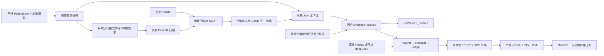

# EviTriage-QL

[English](README.md) | [简体中文](README.zh-CN.md)

**以证据为约束、可审计的 CodeQL 告警二次研判系统。**

EviTriage-QL 从 CodeQL 的 source-to-sink 事实出发，保留其来源，构建有界的
源码上下文和证据，并运行受约束的 Analyst → Rebuttal → Judge 工作流。
随后，确定性策略会给出三种复核标签之一：

- `TP`——现有证据支持真阳性；
- `FP`——决定性反证支持假阳性；
- `NMC`——仍需更多上下文，系统拒绝强行给出二元结论。

每项结论都与精确的 SARIF 结果出现位置及其支撑产物关联。
`auto_dismiss` 永远为 `false`：EviTriage-QL 绝不会自动关闭上游 CodeQL 告警。

> **当前代码版本：v0.2.0（Alpha 研究基础设施）。**这是一个本地 CLI，
> 不是生产漏洞分类器、托管服务或自主修复系统。仓库内的离线演示是确定性
> 合成演示；它证明工作流、策略和产物可复现，不证明模型质量、漏洞准确率或
> 经独立验证的真值。

## 它能做什么

- 接收既有 SARIF 2.1.0 产物或一次全新的 CodeQL 扫描。
- 让两种输入模式进入同一套严格的归一化、上下文和证据流水线。
- 保留原始 SARIF 字节和每条告警精确的
  `(SARIF SHA-256, run_index, result_index)` 身份，不在上游去重。
- 创建仅复制（copy-only）的源码快照，并为每次运行创建独立的可写构建
  副本。EviTriage-QL 自身的文件适配器会把原始源码树仅作为输入。
- 提取有界的 Java Level 0/1 上下文；当源码缺失、不安全、二进制、过大、
  已变化、越界或超预算时，显式记录遗漏。
- 将模型 Claim 限制在闭合、按产物寻址的 Evidence Registry 内。
- 支持确定性的离线 Replay 研判，以及必须显式授权的 DeepSeek 路径。
- 写出严格 JSONL、转义后的 HTML、各阶段产物、SHA-256 manifest 和仅追加
  工作流事件日志。

## 选择运行路径

| 工作流 | 额外要求 | 执行目标代码 | 模型联网 | 成功终态 |
| --- | --- | ---: | ---: | --- |
| `make demo` | 已同步 Python 依赖 | 否 | 否 | `JUDGED`，六条合成裁决 |
| `ingest-sarif` / `normalize` | 匹配的本地源码与 SARIF | 否 | 否 | `CONTEXT_READY`，无标签 |
| `scan` | JDK 17、CodeQL 2.26.1、已准备的 Maven 3.9.9 分发包/依赖缓存 | 是 | 否 | `CONTEXT_READY`，无标签 |
| 使用 Replay 的 `triage --sarif` | 精确匹配、可信且只读的 Replay 条目 | 否 | 否 | `JUDGED`，JSONL 和 HTML |
| `triage --scan` | 真实扫描环境及 Replay 或已授权 DeepSeek | 是 | 取决于提供方 | `JUDGED`，JSONL 和 HTML |
| DeepSeek `triage` | 双重上传策略授权、网络和安全凭据 | 取决于输入 | 是 | `JUDGED`，JSONL 和 HTML |

`CONTEXT_READY` 表示输入、归一化、上下文和证据处理已经完成；它不是
`TP`/`FP`/`NMC` 裁决。只有一次全新的 `triage` 运行会继续经过
`ANALYZED → REBUTTED → JUDGED`。
`triage --scan` 路径已有受控 runner 集成覆盖，但当前代码不声称拥有一次从
全新真实 CodeQL 扫描到 `JUDGED` 的验收产物。

## 五分钟离线快速开始

当前文档化的验收基线使用：

- Python 3.12；包元数据允许 Python `>=3.12,<3.14`；
- 精确版本的 [`uv 0.8.3`](https://docs.astral.sh/uv/)，安装在持久位置并可从
  `PATH` 发现；
- GNU Make 或兼容的 `make`。

在仓库根目录运行：

```bash
uv --version  # 预期：uv 0.8.3
uv sync --all-extras
uv run evitriage doctor --json
make demo
```

第一次 `uv sync` 可能需要访问包索引或已有缓存。锁定依赖可用后，
`make demo` 会使用 `uv run --offline`，不需要 Java、CodeQL、API 密钥、
真实模型或模型服务请求。

演示会打印一个机器可读的 `TriageRunSummary`。成功结果包括：

- `state: "JUDGED"`，且 `real_codeql: false`；
- 六条告警和十八次 Replay 调用；
- 三个 `TP`、两个 `FP` 和一个 `NMC`；
- 指向完整审计目录的 `artifact_run_root`。

可以打开 `<artifact_run_root>/reports/index.html` 查看自包含报告，也可以把
`<artifact_run_root>/reports/decisions.jsonl` 作为严格 JSONL 处理。这些标签
来自固定 Golden SARIF、合成证据和合成 Replay 响应，是复现性夹具，不是
准确率基准。

`doctor` 返回 `status: "ok"` 表示其必需检查通过：Python 版本、可执行的
`uv`、SQLite、可加载的系统配置和可写的受管根目录。它可能创建这些根目录、
设置权限并写入有界探针；它不会校验 uv 固定版本、Make、依赖/缓存完整性或
真实扫描就绪状态。Java、`javac` 和 CodeQL 在其中属于可选诊断；真实扫描
运行器会按 ProjectSpec 校验它们的版本。

## 工作原理



两种输入分支具有不同的输入获取方式和工具 provenance。两者都会分配隔离的
构建副本，但只有扫描会执行该副本并写出 CodeQL 工具日志。原始 SARIF 就绪
后，它们会共享同一个解析器、归一化器、上下文构建器、Evidence Registry、
产物 journal，以及在选择 `triage` 时使用的裁决/报告路径。

模型输出只是候选，不是最终权威。Claim 必须引用精确告警出现位置的证据；
确定性策略会把冲突、未知、未解决的关键 Claim 和支撑不足降级为 `NMC`。
可选的证据补充已按身份绑定且可审计，但其中的 assertion 仍是可信输入，
不是经独立证明的事实。

## 接入既有 SARIF 产物

从 [`configs/projects/example-local.yaml`](configs/projects/example-local.yaml)
开始。私有目标可以使用 `configs/projects/private-my-project.yaml` 这样的
文件名；该模式已被 Git 忽略。把 `source.path` 设置为生成 SARIF 时使用的
精确本地源码版本。

先校验 ProjectSpec，再导入：

```bash
uv run evitriage project validate \
  --config configs/projects/private-my-project.yaml \
  --allowed-source-root /absolute/path/to/source \
  --json

uv run evitriage ingest-sarif \
  --project-config configs/projects/private-my-project.yaml \
  --sarif /absolute/path/to/results.sarif \
  --allowed-source-root /absolute/path/to/source \
  --json
```

若源码位于当前检出目录内，可以省略 `--allowed-source-root`。ProjectSpec
不能自行获得外部源码根目录的访问权限；可信操作者必须在每条命令上重复声明
这条边界。

导入既有 SARIF 绝不会运行 Maven 或 CodeQL。它会原样保留输入字节、为所选
源码创建快照、归一化每个受支持的结果出现位置、提取上下文并构建证据产物。
若被引用的普通源码文件存在，EviTriage-QL 会独立计算其哈希，并拒绝冲突的
SARIF 哈希。缺失源码保持未知和 partial；系统不会声称已经验证缺失文件的
坐标。
源码与 SARIF 的对应关系仍由操作者提供：路径包含和文件哈希检查可以发现
部分冲突，但不能证明所选快照生成了该 SARIF。

`normalize` 接受相同的 `--project-config` 和 `--sarif` 参数。它是同一条
完整路径的显式操作者别名，因此也会构建上下文/证据并终止于
`CONTEXT_READY`；它不是“只做归一化”的快捷命令。

## 运行真实 CodeQL 扫描

> **真实扫描会以当前宿主用户的身份执行目标仓库中已检入的 Maven Wrapper。**
> 受管副本、经过校验的参数向量、环境变量白名单和超时都不是操作系统沙箱。
> 除非提供外部隔离账号、VM 或容器，并施加文件系统、网络、进程、CPU 和
> 内存控制，否则只能扫描可信仓库。没有这些隔离时，目标构建代码仍能读取
> 或修改宿主账号可访问/可写的文件，包括主目录内容和可写的原始源码树。

EviTriage-QL 不会安装外部扫描工具链。仓库内示例要求：

- `PATH` 上存在 CodeQL CLI `2.26.1`；
- `java` 和 `javac` 来自同一个 JDK 17；
- 已检入、可执行且不是符号链接的 `./mvnw`；
- 配置使用 `--offline` 构建，因此 Wrapper 缓存中已存在声明的 Maven 3.9.9
  分发包，Maven 本地仓库/缓存中已存在项目依赖；
- 可选 query/model pack 使用精确的 `scope/name@x.y.z` 固定版本。

先验证外部工具，再执行扫描：

```bash
codeql version --format=terse
java -version
javac -version

uv run evitriage scan \
  --project-config configs/projects/example-local.yaml \
  --json
```

运行器会校验配置中的 CodeQL/JDK 版本，并在工具缺失、版本不匹配、超时、
非零退出、不安全输出或无效 SARIF 时产生结构化失败。它绝不会用 Golden
SARIF 代替失败的真实扫描。成功的 `scan` 会报告 `real_codeql: true` 并终止于
`CONTEXT_READY`。

`build.network_policy: disabled` 只要求 Maven 使用 `--offline`，不是操作系统
强制的网络命名空间。Maven 缓存的准备和证明属于外部供应链责任。

## 运行 Analyst / Rebuttal / Judge 研判

使用离线 Replay：

```bash
uv run evitriage triage \
  --project-config configs/projects/private-my-project.yaml \
  --sarif /absolute/path/to/results.sarif \
  --llm-profile configs/llm/replay-v0.1.yaml \
  --replay-cache /trusted/read-only/replay-cache \
  --allowed-source-root /absolute/path/to/source \
  --json
```

`--sarif` 和 `--scan` 必须且只能选择一个。将 `--sarif ...` 替换为 `--scan`
会在同一个新运行中执行一次全新的 CodeQL 扫描，并继续生成报告。

Replay 按请求哈希寻址：每个必需的
`<canonical-request-sha256>.json` 响应都必须预先存在，并满足严格的角色
schema。仓库只包含固定的合成演示包，不提供任意项目通用的 Replay cache
生产器。缺失条目会生成可审计的 `MODEL_FAILED` 运行，绝不会回退到远程
提供方。

### 可选 DeepSeek 提供方

可选启用的适配器只接受当前代码实现的两个固定模型 ID：
`deepseek-v4-pro` 和 `deepseek-v4-flash`，并把连接固定为
`api.deepseek.com:443/chat/completions`。只有可信 ProjectSpec 和 LLM Profile
同时声明 `remote_llm_allowed` 时，才允许远程研判。

**绝不要把 API 密钥放入聊天、命令参数、YAML、`.env`、shell 脚本、日志、
Git 或运行产物。已经通过聊天暴露的密钥必须先撤销，再录入替代密钥。**
当前实现的凭据来源包括单进程 `DEEPSEEK_API_KEY`、TPM2/systemd-creds 和
pass/GPG。录入与提供方选择见
[部署与运行指南](docs/deployment-guide.zh-CN.md#9-可选-deepseek-远程研判)。

凭据保护只覆盖密钥，不保护已授权上传的数据。证据和有界源码摘录会发送给
DeepSeek，可能受到提供方保留、费用和司法辖区规则约束。模式脱敏不是通用
DLP 系统。

## 运行产物与审计轨迹

预检校验成功且流水线启动后，每次 `ingest-sarif`、`normalize`、`scan` 或
`triage` 调用都会分配一次全新的运行。分配前的校验失败不会产生 run 目录。
成功的 triage 运行目录如下：

```text
artifacts/runs/<run-id>/
├── project-spec.resolved.yaml
├── workflow-events.jsonl
├── run-manifest.json
├── input/source.sarif or codeql/results.sarif
├── normalized/alerts.json
├── context/
│   ├── index.json
│   ├── slices/*.json
│   └── source-map.html
├── evidence/
│   ├── registry.json
│   └── graph.dot
├── triage/
│   ├── analyst.json
│   ├── rebuttal.json
│   └── judged.json
└── reports/
    ├── decisions.jsonl
    └── index.html
```

`workflow-events.jsonl` 是仅追加的状态历史；`run-manifest.json` 是当前/最终
投影，不是仅追加数据库。最终化之前，journal 会重新打开每个已注册产物，
复验大小和 SHA-256，并把产物与审计文件设为仅所有者可读（`0400`）。
在 run 分配之后发生的失败会保留结构化、已脱敏的错误元数据，以及此前
已产生的有界工具产物。

哈希和只读权限能让意外修改可检测，但不是防篡改账本；文件所有者或 root
仍可修改权限和字节。重要运行应归档到独立控制的存储中。

报告可能包含有界源码摘录。HTML 转义可以防止活动标记，但不是秘密脱敏，
也不是公开发布内容的授权。JSONL、HTML、SARIF、工作区和运行产物至少应按
被分析源码的同等强度保护。

## 当前边界

- 只能物化本地 Java 项目。Git 和 dataset 来源类型只是在 schema 中预留；
  远程获取、dataset adapter 和 submodule 物化尚未实现。
- 真实扫描只支持通过已检入 Maven Wrapper 运行 CodeQL `java-kotlin`。
  Gradle、裸 Maven、任意构建命令和其他语言均不可用。
- SARIF 解析器有意只支持 SARIF 2.1.0 的有界子集；本项目不是脱离源码的
  通用 SARIF 查看器。
- Java 上下文使用有界固定窗口或词法 callable 边界，不是编译器 AST/CFG
  语义、路径可行性证明或全仓分析；`adaptive_slice` 明确不可用。
- `analysis.target_cwes` 会被校验和记录，但当前不会过滤 SARIF 结果。
- 当前没有自动验证、校准置信度、通用 Replay 生产器、旧 run 续跑、崩溃
  恢复、调用方指定 run ID、独立 `report --run-id` 或跨 run 聚合。
- 项目提供最小 SQLite schema 和迁移命令，但当前工作流不会向其中写入或
  索引 run；可审计记录以每次运行目录内的文件为准。
- 任何输出都不应成为关闭告警、发布漏洞或接受生产风险的唯一依据。

详细边界见 Gate G [限制清单](KNOWN_LIMITATIONS.zh-CN.md)、
[v0.2.0 扩展说明（英文）](docs/releases/v0.2.0.md)和
[安全/披露流程](SECURITY.zh-CN.md)。部分历史文档仍保留 v0.1 的范围标签；
这里的可执行代码和包版本为 v0.2.0。

## 证据不等于准确率结论

| 已记录证据 | 它能证明什么 | 它不能证明什么 |
| --- | --- | --- |
| 确定性的六案例 `make demo` | 离线工作流、策略、报告和产物可复现 | 模型质量、独立标签或泛化能力 |
| 固定版本的真实 CodeQL 冒烟 | 外部运行器、查询、SARIF 和上下文路径在记录环境中可运行 | 可利用性、TP/FP/NMC 裁决或任意项目就绪 |
| 对合成夹具的一次获准 DeepSeek 冒烟 | 当时的凭据、HTTPS 提供方、严格响应和三角色路径可运行 | 准确率、费用、重试/限流行为或持续可用性 |
| 由哈希闭合的 wheel/sdist/SBOM/测试/示例包 | 同宿主发布组装与完整性校验 | 产物签名、第二宿主复现或生产就绪 |

精确命令、run ID、哈希、失败和解释边界保存在
[历史交付证据日志（英文）](docs/progress/2026-07-27-v0.1.md)中，不作为
首页产品主张重复罗列。

## 开发与发布验证

同步依赖后运行：

```bash
# 锁文件、格式、lint、严格类型、schema、secret scan、测试和分支覆盖率门禁。
make check

# 可直接选择的信任边界回归；完整权威门禁仍为 check。
make security-test

# 确定性的端到端合成工作流。
make demo
```

开发时可运行聚焦测试：

```bash
uv run pytest tests/unit/test_sarif_normalizer.py -q
```

构建并独立验证本地发布闭包：

```bash
make release-artifacts
make release-verify
```

默认的 `dist/release/0.2.0/` 闭包包含 wheel、源码分发包、带哈希的依赖清单、
CycloneDX 1.5 SBOM、机器可读测试摘要、经审阅的演示证据、严格发布 manifest
和 `SHA256SUMS`。这些命令不会创建 tag、发布或签名。详见
[复现指南（英文）](docs/reproducibility.md)。

## 仓库结构

```text
src/evitriage/     CLI、Domain 模型、流水线、适配器、策略、报告
configs/           严格的系统、项目和 LLM Profile 示例
schemas/           生成的公共 JSON Schema
tests/             单元、集成、安全测试、夹具和 Replay 包
docs/              需求、架构、ADR、部署、进度和发布文档
migrations/        最小本地 SQLite schema
```

带日期的项目蓝图描述了更长期的研究设计，包含超出当前 v0.2.0 可执行边界的
能力。判断当前可用功能时，应以 CLI help、严格 schema、测试和已知限制文档
为准。

## 文档

- 历史需求与完成度复核：
  [项目蓝图](docs/requirements/project-blueprint-2026-07-20.zh-CN.md)、
  [Codex 完整构建提示词](docs/requirements/codex-build-prompt-2026-07-20.zh-CN.md)和
  [v0.1 日期推进计划](docs/progress/2026-07-20-v0.1-delivery-plan.zh-CN.md)。
  `v0.1` P0/Gate A–G 发布范围已经完成；更长期的科研蓝图仅部分实现，日期
  推进计划是历史基线，不是实时待办清单。
- [双环境阶段总结与可执行计划](docs/progress/2026-07-23-stage-summary.zh-CN.md) |
  [Dual-environment stage summary](docs/progress/2026-07-23-stage-summary.md)
- [部署与运行](docs/deployment-guide.zh-CN.md) |
  [Deployment and operations](docs/deployment-guide.md)
- [架构与信任边界（英文）](docs/architecture.md)
- [Gate G 限制清单](KNOWN_LIMITATIONS.zh-CN.md) |
  [Gate G limitation inventory](KNOWN_LIMITATIONS.md)
- [安全策略](SECURITY.zh-CN.md) | [Security policy](SECURITY.md)
- [复现 v0.2.0（英文）](docs/reproducibility.md)和
  [v0.2.0 说明（英文）](docs/releases/v0.2.0.md)
- [架构决策（英文）](docs/adr/)和
  [历史交付证据日志（英文）](docs/progress/2026-07-27-v0.1.md)
- [参与贡献](CONTRIBUTING.zh-CN.md) | [Contributing](CONTRIBUTING.md)

## 许可证与引用

EviTriage-QL 使用 [Apache License 2.0](LICENSE)。该许可证只覆盖本仓库自身的
代码和文档；目标仓库、CodeQL、Maven 和外部数据集保留各自条款。引用元数据
见 [`CITATION.cff`](CITATION.cff)。
