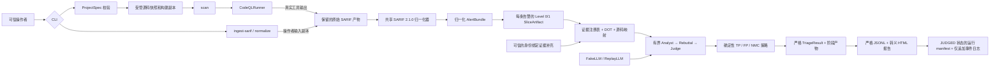

# EviTriage-QL

[English](README.md) | [简体中文](README.zh-CN.md)

**基于证据的 CodeQL 告警 LLM Agent 二次研判系统**
基于 CodeQL 路径证据与大模型 Agent 的可审计漏洞告警二次筛选系统

> 当前版本：**v0.2.0**。该版本在受限的 Gate G 研究版本上增加了失败
> 关闭（fail-closed）的环境变量、TPM2/systemd-creds 和 pass/GPG 凭据
> 提供方。源码分发包已在洁净环境中通过完整检查和演示流程；发布产物由
> 哈希闭合并包含 CycloneDX SBOM，使用固定版本 CodeQL 的全新冒烟测试也
> 已通过。六案例矩阵以及经审阅的 JSONL、HTML、manifest 和测试摘要均在
> 同一校验和闭包中。本版本不声称已在第二台主机复现、已对产物签名、已
> 完成模型质量基准测试或已具备生产就绪性。
>
> 仓库中的代码支持严格的本地项目配置、受管源码快照和工作区、真实
> CodeQL 命令运行器、既有 SARIF 导入、确定性的 SARIF 2.1.0 归一化、
> 有界的 Java Level 0/1 上下文、按产物寻址的证据注册表以及按运行隔离的
> 审计产物。离线 Golden SARIF 路径无需 Java 或 CodeQL 即可测试。2026-07-22，
> 使用 Java 17/CodeQL 2.26.1 对原始 Socket 型 CWE-22 案例的扫描产生了
> 一条带八步路径的 `java/path-injection` 结果并到达 `CONTEXT_READY`。
> 这是查询和流水线证据，不是漏洞裁决，也不能替代洁净环境复现。2026-07-23，
> 对自包含六案例 Maven 项目的全新扫描产生了四条真实查询结果并到达
> `CONTEXT_READY`；它与合成的六结果决策矩阵有意分开。
>
> 仅离线的 Gate D 路径提供严格的 Fake/Replay 结构化模型适配器、有界的
> Analyst/Rebuttal/Judge 顺序、证据闭合的 Claim、保守的 TP/FP/NMC
> 策略、`triage` CLI、持久化 Agent 状态以及已注册的决策产物。成功研判
> 会在最终化之前同时注册严格的逐告警 JSONL 和转义后的 HTML 报告，并可
> 接受既有 SARIF 或同次运行中的 CodeQL 扫描。默认 `make demo` 将六个
> 已检入 Java 微型案例、Golden SARIF、严格按身份绑定的合成证据补充、
> 离线 Replay 配置和十八个以 SHA-256 寻址的响应绑定为一个确定性的无密钥
> 工作流，生成 CWE-22 TP/FP/NMC、CWE-78 TP/FP 及提示词注入安全证据。
> 这些是合成的工作流/策略夹具，不是准确率证据。
>
> 可选启用的 DeepSeek V4-Pro/Flash 适配器仅允许 DeepSeek 官方 HTTPS
> 端点和显式远程数据策略。验收测试使用模拟端点。另行授权的 2026-07-23
> 在线冒烟测试完成了三次结构化调用，并对一个合成夹具到达 `JUDGED`；
> 这是提供方路径证据，不是质量基准。

## 问题

CodeQL 能识别许多潜在安全相关的数据流，但仍需人工判断每条路径是否
可行、是否可利用。完整的 EviTriage-QL 设计会保留 CodeQL 的 source-to-sink
事实，把每项主张绑定到稳定证据，并通过有界的 Analyst/Rebuttal/Judge
工作流给出三种可审计结果之一：真阳性（`TP`）、假阳性（`FP`）或需要
更多上下文（`NMC`）。系统绝不会自动关闭上游告警。

Gate B 建立两个输入分支，Gate C 消费其共享输出：真实 `scan` 和操作者
提供的 `ingest-sarif` 都会保留原始 SARIF 并计算哈希，进入同一个归一化器，
随后使用相同的上下文/证据路径。这样既能支持离线复现，又不会把 Golden
数据冒充为真实 CodeQL 结果。

## Gate C/D 流水线与 Gate E 离线报告



详细边界和信任假设见
[`docs/architecture.md`](docs/architecture.md)。基础架构、输入汇合与
上下文/证据决策记录于
[`ADR 0001`](docs/adr/0001-initial-architecture.md)、
[`ADR 0002`](docs/adr/0002-gate-b-input-convergence.md)、
[`ADR 0003`](docs/adr/0003-gate-c-context-evidence.md) 和
[`ADR 0004`](docs/adr/0004-gate-c-extra-query-positive-benchmark.md)。
有界离线研判见
[`ADR 0005`](docs/adr/0005-gate-d-bounded-triage-core.md)；DeepSeek 的显式
远程数据与凭据边界见
[`ADR 0006`](docs/adr/0006-deepseek-v4-opt-in-provider.md)，多凭据提供方选择
见 [`ADR 0013`](docs/adr/0013-deepseek-multi-credential-providers.md)；
首个离线报告切片见
[`ADR 0007`](docs/adr/0007-gate-e-offline-reports.md)。固定离线演示包见
[`ADR 0008`](docs/adr/0008-gate-e-offline-demo.md)，三标签证据/扫描闭环见
[`ADR 0009`](docs/adr/0009-gate-e-three-label-and-scan-closure.md)。

## 五分钟离线快速开始

经过测试的 Golden SARIF 路径需要：

- Python 3.12；
- 将 [`uv 0.8.3`](https://docs.astral.sh/uv/) 安装在持久位置，并确保全新
  login shell 的 `PATH` 可以找到；
- GNU Make（或兼容的 `make`）。

`pyproject.toml` 中可执行的 `tool.uv.required-version` 门禁会拒绝其他 uv
版本。`/tmp` 下的临时 bootstrap 可用于恢复，但不算完成开发环境部署。
同步前先验证环境：

```bash
command -v uv
uv --version  # 预期：uv 0.8.3
```

此 Golden 路径不需要 Java、Maven、CodeQL 或 API 密钥。锁定的 Python
依赖可用后，导入命令本身不会发起网络请求；首次 `uv sync` 仍可能需要
现有包缓存或访问包索引。在仓库根目录运行：

```bash
uv sync --all-extras
make check

# 完整离线 TP/FP/NMC 演示：无需 Java、CodeQL、API 密钥或真实模型。
make demo

uv run evitriage project validate \
  --config configs/projects/example-local.yaml \
  --json

uv run evitriage ingest-sarif \
  --project-config configs/projects/example-local.yaml \
  --sarif tests/fixtures/sarif/single-path.sarif \
  --json

uv run evitriage doctor --json
```

`make demo` 为六条告警输出一个机器可读的 `TriageRunSummary`。其
`artifact_run_root` 包含保留的 SARIF、归一化告警、上下文、证据、三个
Agent 阶段、`reports/decisions.jsonl`、`reports/index.html`、仅追加工作流
事件日志和最终运行 manifest。演示只使用
`tests/fixtures/replay-bundles/gate-e-three-label-v0.1` 下固定的合成 Replay
包和 `tests/fixtures/evidence/` 下严格绑定的补充；更改提示词、响应 schema、
配置、源码、SARIF、补充或请求身份都会显式失败。三 TP、两 FP、一 NMC
的输出是复现性和策略夹具，不是模型质量或漏洞准确率主张。

## Gate G 发布产物与洁净环境路径

在 `make check` 和 `make demo` 通过后，构建并独立验证发布闭包：

```bash
make release-artifacts
make release-verify
```

默认的 `dist/release/0.2.0/` 包含 wheel、源码分发包、带哈希的 all-extras
锁文件导出、CycloneDX 1.5 SBOM、六案例矩阵摘要、经审阅的示例 JSONL/HTML
及其运行 manifest、机器可读的完整/安全测试摘要、严格发布 manifest 和
`SHA256SUMS`。`make release-artifacts` 在组装前会运行完整 pytest、安全
pytest 和全新的六案例演示。版本漂移、失败的测试摘要、案例/报告身份不匹配、
未知或过期文件、符号链接、不安全名称或产物篡改都会使构建失败。它不会
创建 tag、发布、签名，也不会把独立的真实 CodeQL 冒烟结果变成模型裁决。

源码分发包重装流程和真实工具冒烟边界见
[`docs/reproducibility.md`](docs/reproducibility.md)。v0.2.0 的范围、证据、
产物和解释限制见 [`docs/releases/v0.2.0.md`](docs/releases/v0.2.0.md)。

`ingest-sarif` 会创建受管源码快照和独立运行目录，把输入字节原样复制到
`input/source.sarif`，记录 SHA-256，并写入 `normalized/alerts.json`、
每条告警的 `context/slices/*.json`、`context/index.json`、
`evidence/registry.json`、`evidence/graph.dot`、已转义的
`context/source-map.html`、解析后的 ProjectSpec/工作区描述符及审计文件。
最终化之前，journal 会重新打开每个已注册产物，验证大小和 SHA-256，并把
产物及审计文件设为仅所有者可读（`0400`）。`normalize` 接受相同参数，并
作为独立 CLI 操作刻意复用同一归一化器：

```bash
uv run evitriage normalize \
  --project-config configs/projects/example-local.yaml \
  --sarif tests/fixtures/sarif/multi-path.sarif \
  --json
```

两个命令都不会修改所配置的夹具源码。运行数据库、工作区和产物均被 Git
忽略。对于检出目录外的本地源码，可信操作者必须显式重复
`--allowed-source-root /canonical/root`；ProjectSpec 不能扩大自身文件系统
权限。

Gate D 使用由操作者控制、按请求哈希寻址的 Replay 缓存：

```bash
uv run evitriage triage \
  --project-config configs/projects/example-local.yaml \
  --sarif tests/fixtures/sarif/single-path.sarif \
  --llm-profile configs/llm/replay-v0.1.yaml \
  --replay-cache /trusted/read-only/replay-cache \
  --json
```

要在一次全新运行中扫描并继续研判，请用且仅用 `--scan` 替代 `--sarif`：

```bash
uv run evitriage triage \
  --project-config configs/projects/example-local.yaml \
  --scan \
  --llm-profile configs/llm/replay-v0.1.yaml \
  --replay-cache /trusted/read-only/replay-cache \
  --json
```

仓库只附带固定的合成演示响应，不提供通用缓存写入器。所有必需的
`<request-sha256>.json` 必须已经存在并满足严格角色 schema；缺失条目会
产生可审计的 `MODEL_FAILED` 运行，而不是回退到网络提供方。可用
`--evidence-supplement` 提供可信证据补充；其项目、快照、原始 SARIF 和
精确结果出现位置必须匹配，且只能增加 assertion，不能设置 Claim 或期望标签。

成功时，同一最终化运行包含 `reports/decisions.jsonl`（每条归一化告警一个
严格 `AlertReport`）和 `reports/index.html`（自包含审计视图）。两者以
`report` 角色注册到 manifest，经 SHA-256 复验并设为仅所有者可读。HTML
会转义不可信源码/SARIF/模型文本，并明确说明 confidence 未校准、未执行
验证且没有自动关闭告警。JSONL 可包含有界源码摘录，必须按被分析源码同等
级别保护。

### DeepSeek V4：多凭据提供方 API 密钥交接

仓库中的 DeepSeek 配置选择 `deepseek-v4-pro`，也接受另一个官方模型 ID
`deepseek-v4-flash`。适配器没有可配置 URL：它只连接
`api.deepseek.com:443`、只向 `/chat/completions` 发送请求、要求 JSON
Output、禁用 thinking/tool calls，并通过与 Replay 相同的证据边界验证结果。
[LLM 调用与凭据流设计](docs/llm-invocation-and-credential-flow.md)说明完整
研判路径和已实现的 WSL/Linux 多凭据架构。
[DeepSeek 官方 API 文档](https://api-docs.deepseek.com/)是端点和当前 V4
模型标识的来源。

**不要**在聊天中发送 API 密钥，也不要把它放入命令参数、YAML、`.env`、
shell 脚本或 Git 文件。已经通过聊天发送的密钥必须先撤销再存储，因为其
历史副本无法重新变为秘密。凭据选择与模型选择相互独立：

- `environment` 只读取当前进程的 `DEEPSEEK_API_KEY`，从不持久化；
- `systemd-creds` 使用固定的、TPM2 绑定的 Linux 密文路径；
- `pass` 通过 GPG 读取固定的 `evitriage/deepseek-api-key` 密码库条目；
- `auto` 按 `environment → systemd-creds → pass` 尝试。

显式选择绝不回退。`auto` 只会跳过不可用的提供方：若已选择的环境值格式
错误、systemd 密文无法解密，或已安装的 pass 条目 GPG 解密失败，研判会
停止，而不会尝试另一凭据。

在带 TPM2 和 systemd 的 Linux 主机上，请使用仓库外的加密凭据库。操作者
必须能访问 `/dev/tpmrm0`；在当前主机上，这需要一次管理员操作并完整退出/
重新登录：

```bash
sudo usermod -aG tss liyitao
```

启动新的登录会话后，通过隐藏提示输入轮换后的密钥一次，并只检查非秘密状态：

```bash
uv run evitriage credentials set-deepseek --provider systemd-creds
uv run evitriage credentials status --json
```

加密 blob 保存在检出目录外：
`~/.local/share/evitriage/credentials/evitriage-deepseek-api-key.cred`，
目录权限为 `0700`、文件为 `0600`。`systemd-creds` 使用 TPM2 加密；
`triage --credential-provider systemd-creds` 每次运行通过内存管道解密。
不会创建明文凭据文件。只有轮换既有加密凭据时才使用 `--replace`。

WSL 通常没有可用的 TPM2/systemd-creds 路径。若要在 WSL 或原生 Linux
持久存储，请安装标准 `pass` 和 GPG，使用**受口令保护**的 GPG 私钥初始化
密码库，再通过隐藏的双重提示录入：

```bash
pass init <your-gpg-key-id>  # 在 EviTriage 外一次性设置 pass/GPG
uv run evitriage credentials set-deepseek --provider pass

uv run evitriage triage \
  --project-config configs/projects/example-local-deepseek-v4.yaml \
  --sarif tests/fixtures/sarif/single-path.sarif \
  --llm-profile configs/llm/deepseek-v4-pro.yaml \
  --credential-provider pass \
  --json
```

EviTriage 将 `PASSWORD_STORE_DIR` 固定为真实操作者主目录下的
`~/.password-store`，禁用 pass 扩展、校验 `pass` 可执行文件，并只通过
标准输入把密钥传给 `pass insert`。GPG agent 可能缓存私钥解锁状态；这会
改善易用性，但意味着在缓存过期前同一用户的进程可能使用该 agent。请按
主机风险设置较短 TTL，并在会话结束时锁定或终止 agent。Secret Service/
Python keyring 不作为默认方案，因为 WSL、CI、SSH 等无头环境不能可靠
假设存在桌面 D-Bus 会话和已解锁 keyring。

对于临时运行或没有加密存储的主机，请使用一次性的隐藏环境提示：

```bash
(
  trap 'unset DEEPSEEK_API_KEY' EXIT
  read -rsp 'DeepSeek API Key: ' DEEPSEEK_API_KEY
  printf '\n'
  export DEEPSEEK_API_KEY

  uv run evitriage triage \
    --project-config configs/projects/example-local-deepseek-v4.yaml \
    --sarif tests/fixtures/sarif/single-path.sarif \
    --llm-profile configs/llm/deepseek-v4-pro.yaml \
    --credential-provider environment \
    --json
)
```

所有后端中，明文只用于构造 HTTPS `Authorization: Bearer` 请求头，不会
复制到模型消息、请求/响应产物、manifest、子进程环境或结构化错误中。凭据
保护只覆盖 API 密钥：当两个可信策略都声明 `remote_llm_allowed` 时，证据
项和源码摘录**仍会**发送给 DeepSeek。

不存在有意义的“绝对安全”保证：密钥必然会短暂存在于进程内存中（对
`environment` 而言还在进程环境中），并会被提供方接收。TPM2 不能防御
已授权的同用户进程；pass/GPG 不能保护已解锁的 gpg-agent 会话。高保障
部署应使用专用运行账户和操作系统/云密钥管理器。仓库忽略 `.env`、密钥、
secret、密码库、响应、工作区和产物文件；`make check` 还会在可提交文件
匹配凭据模式时失败。可直接运行：

```bash
uv run python -m evitriage.secret_scan
```

运行可单独选择的 Gate F 攻击类别回归套件：

```bash
make security-test
```

该离线子集覆盖提示词注入隔离、恶意 SARIF URI、路径/符号链接逃逸、HTML
转义、shell 元字符引用和秘密脱敏。权威质量/覆盖率门禁仍为 `make check`。

开发时可运行单项测试，例如：

```bash
uv run pytest tests/unit/test_sarif_normalizer.py -q
```

使用 `uv run pytest --collect-only -q` 查找当前检出目录中真实存在的测试名。

## 已实现的 Gate B/C 输出与 Gate D 研判

两个示例 ProjectSpec 通过同一 `ProjectRegistry` 选择不同的原始合成 Java 17
夹具。构建计划只调用已检入的 Apache Maven Wrapper 3.3.4 启动器并声明
Maven 3.9.9；裸机 `mvn`、Gradle、显式命令、shell 和内联解释器均被拒绝。
本地获取只允许复制：每次运行从内容寻址、只读快照创建隔离的可写副本进行
构建，绝不在原始源码目录中构建。

当前 SARIF 边界支持：

- SARIF 2.1.0 runs、rules、results、主/附加/关联位置、artifacts、URI bases、
  `codeFlows`、fingerprints 和 partial fingerprints；
- 单路径、多路径、无路径、重复结果、缺失 snippet、多 run 和 Windows URI；
- 保留每次出现的路径顺序及稳定的告警/路径 SHA-256 身份；
- 每条归一化告警上的精确原始引用
  `(raw SARIF SHA-256, run index, result index)`；
- 拒绝错误坐标、重复 JSON 键、遍历、远程或 UNC 源 URI、符号链接逃逸，以及
  非空结果 run 缺失/不支持的 `columnKind`。

这里的快照绑定是路径包含规则，不是源码版本证明。对于既有 SARIF，操作者
必须选择相应源码版本；当引用的普通文件存在时，Gate B 会独立计算 SHA-256
并拒绝相冲突的 SARIF 声明。缺失文件仍允许，但归一化为
`artifact_sha256=null`。坐标先验证正数/顺序语义；Gate C 只有在安全打开
普通 UTF-8 文件后才按 run 声明的 UTF-16 code unit 或 Unicode code point
单位检查边界并包含源码。缺失、二进制、过大或越界源码会形成显式 `partial`
遗漏，而不是虚构摘录。主要 Golden SARIF 的路径、行号、snippet 和声明
哈希与检入的 `PathReader.java` 夹具一致。

成功的输入运行终止于 `CONTEXT_READY`。`path_function_slice` 为主、附加、
关联及 source/sink/path 位置选择词法识别出的最小 Java callable；
`fixed_window` 也可执行。24,000 token 估算是确定性的字节预算，超预算范围
会记录为遗漏。`adaptive_slice` 明确不可用。Evidence item 只能引用已注册
的归一化/切片产物哈希；关系和 Claim 合同拒绝悬空 evidence ID。这些 CLI
输入运行不会生成主张或漏洞分类。source-map HTML 是转义后的导航视图，
不是裁决或 Gate E 报告。

Gate C-Extra 通过真实运行 `20260721T201029897333Z-849cee21ce99` 完成有界
验收：原始 Socket 型 CWE-22 案例产生一条 CodeQL `java/path-injection`
结果、一条完整八步路径、一个完整 `readRequestedFile` 切片、四个 evidence
item 和零 claim，并到达 `CONTEXT_READY`。其 Golden 等价物不能满足此门禁。
冻结边界和产物哈希见 ADR 0004 及带日期的进度日志。

有界 Gate D 路径增加：

- 严格的 `LLMProfile`、Analyst、Rebuttal、Judge、`FinalDecision` 和
  `TriageResult` 合同及生成的 JSON Schema；
- 有序的 Fake/Replay 结构化调用、规范请求哈希、每个角色最多一次 schema/
  evidence 修复、每条告警最多六次调用，以及不跟随符号链接的有界 Replay
  缓存读取；
- 精确到告警出现位置的证据校验和由代码分配、按内容派生的 Claim ID；
- 确定性门禁：TP 需要匹配的 source-control、data-flow 和 sink-semantics
  证据（或决定性的成功验证）；FP 需要决定性 Rebuttal 证据；冲突、未知、
  关键证据缺失或较弱情形均降为 NMC；`auto_dismiss` 永远为 false；
- 提示词边界把仓库/SARIF 文本放入 `untrusted_code_data`，明确拒绝其中的
  指令或工具权限；
- 在规范请求哈希和每个模型/提供方边界前执行确定性凭据模式脱敏，同时保留
  精确本地证据供审计。

`triage` 命令要求既有 `--sarif` 和真实 `--scan` 二选一，分配全新运行，
复用归一化/上下文/证据实现，并依次进入 `ANALYZED`、`REBUTTED`、`JUDGED`。
它持久化 `triage/analyst.json`、`triage/rebuttal.json` 和
`triage/judged.json`，记录非秘密提示词/请求/响应哈希及 profile/model
身份，复验全部已注册产物哈希并将其最终化为仅所有者可读。相同源码/SARIF
输入获得稳定的 `analysis_identity`，因此 Replay 请求哈希不依赖新生成的
操作 `run_id`。

既有的最终化 Gate C 运行不会被重新打开或改标签。仓库包含固定、合成且由
SHA-256 清单约束的 Replay 包，包括默认六案例 v0.1 `make demo`。其身份
绑定补充会明确暴露合成测试 oracle；绑定和哈希本身不能独立证明 assertion
为真。通用缓存生产器/证明、按旧 `run_id` 继续研判和独立
`report --run-id` 命令尚未实现。DeepSeek 适配器有模拟 HTTP/CLI 覆盖和
一次另行授权的在线冒烟记录。运行
`20260722T174132749958Z-8fce5d0ab3f9` 使用 TPM2 凭据路径，接受了三个
角色响应，并将一个合成告警保守地最终化为 `NMC`，`auto_dismiss=false`。
该单次运行只验证当时的凭据、提供方、严格响应和决策路径；token 用量、
成本、可重复性、限流行为和模型质量均未测量。

Gate A 命令仍可使用：

- `project validate` 严格校验并解析 ProjectSpec；
- `doctor` 报告 Python、uv、SQLite、受管根、Java、`javac` 和 CodeQL 状态，
  不虚构不可用工具；
- `db migrate` 创建或升级最小本地 SQLite schema；
- `WorkspaceManager` 分配并准备源码快照与隔离的可写路径。

## 运行真实 CodeQL 扫描

本项目**不会安装** CodeQL 或 JDK。真实 Gate B 扫描要求受控执行环境同时
满足：

- `PATH` 上存在 CodeQL CLI `2.26.1`，与 ProjectSpec 固定版本一致；
- 配置的同一 JDK 提供匹配的 `java` 和 `javac`（检入示例使用 JDK 17）；
- 使用检入的离线构建命令时，声明的 Maven 3.9.9 已存在于 Maven Wrapper
  缓存。

Maven Wrapper 启动器已检入，但首次 bootstrap 可能下载 Maven。请在单独
受控步骤中填充并验证缓存；配置的目标构建本身会传入 `--offline`。
ProjectSpec/wrapper properties 声明 Maven 分发包及校验和；Gate B 运行器
不会独立证明缓存中的 Maven 二进制或观察其真实版本。它会验证 wrapper
properties 使用不含凭据的 HTTPS URL，指向一个精确 Apache Maven 版本并
包含小写 SHA-256。可选 CodeQL query/model pack 必须使用精确
`scope/name@x.y.z` 固定版本。

确认外部安装后，使用相同项目配置：

```bash
codeql version --format=terse
java -version
javac -version

uv run evitriage scan \
  --project-config configs/projects/example-local.yaml \
  --json
```

运行器会校验受管路径和 wrapper 计划，以参数向量及 `shell=False` 调用外部
工具，只传递显式的非秘密环境变量白名单，施加超时，并保留命令元数据和有界、
脱敏的 stdout/stderr 产物。工具缺失、版本不匹配、超时、非零退出或不安全
产物都会形成结构化失败运行，绝不会合成成功。失败运行持久化脱敏的
`metadata/error.json`，从终止事件链接其哈希，并注册失败前已经产生的有界
CodeQL 命令/日志产物。Golden SARIF 是原始测试数据，不证明 CodeQL 分析过
任一 Java 夹具。

成功的本地冒烟运行记录为
`20260721T114113190209Z-8d9afd2ef3b7`：CodeQL database create 和
`java-security-extended.qls` analysis 均以 0 退出，运行到达 `NORMALIZED`，
保留 SARIF 的 SHA-256 为
`f6ba2d5bacc5bf6ca88e9a66063a2bff9579cddcb0e0176d40c3d4185ded62c1`。
其中 120 个规则描述符和零结果证明该夹具完成了真实工具路径；不证明其他
代码没有漏洞。带日期的证据日志也保留更早的工具缺失和无效 suite 失败，
没有改写历史。

## 可复现性

可复现的离线基线为：

```bash
uv sync --all-extras
make check
uv run evitriage doctor --json
uv run evitriage ingest-sarif \
  --project-config configs/projects/example-local.yaml \
  --sarif tests/fixtures/sarif/single-path.sarif \
  --json
```

请提交并保持 `uv.lock` 和生成的 JSON Schema。运行开始后不要修改已解析
配置或源码快照；将 manifest、事件日志、原始 SARIF、归一化 bundle 及其
SHA-256 身份与研究产物一并保留。带日期的证据日志见
[`docs/progress/2026-07-27-v0.1.md`](docs/progress/2026-07-27-v0.1.md)。

## 限制、安全与伦理

当前边界完整列于
[`KNOWN_LIMITATIONS.zh-CN.md`](KNOWN_LIMITATIONS.zh-CN.md)。除受限
DeepSeek V4 适配器之外的模型平台提供方、通用 Replay 缓存生产器、旧运行
续接、独立报告命令和经独立验证的生产证据补充仍不可用。远程 Git 获取、
Gradle、自适应上下文和自动验证也不在当前 Gate 内。

目标仓库、源码注释、构建文件和 SARIF 文档均是不可信数据。它们不得选择
模型端点、提供秘密、扩大工具权限或变成 shell 命令。真实 `scan` 会执行
目标构建，而当前受管工作区不是完整的操作系统沙箱；除非配有外部最小权限
网络/资源/进程沙箱，否则当前运行器只适用于可信夹具或仓库。不要使用本
研究软件攻击未获明确授权的系统，也不要在协调披露前公开敏感漏洞细节。
报告方式见 [`SECURITY.zh-CN.md`](SECURITY.zh-CN.md)。

## 许可证与引用

EviTriage-QL 使用 [Apache License 2.0](LICENSE)。该许可证只覆盖本仓库自身
的代码和文档；目标仓库、CodeQL、Maven、来自第三方的夹具和数据集保留各自
许可证。引用元数据见 [`CITATION.cff`](CITATION.cff)。
