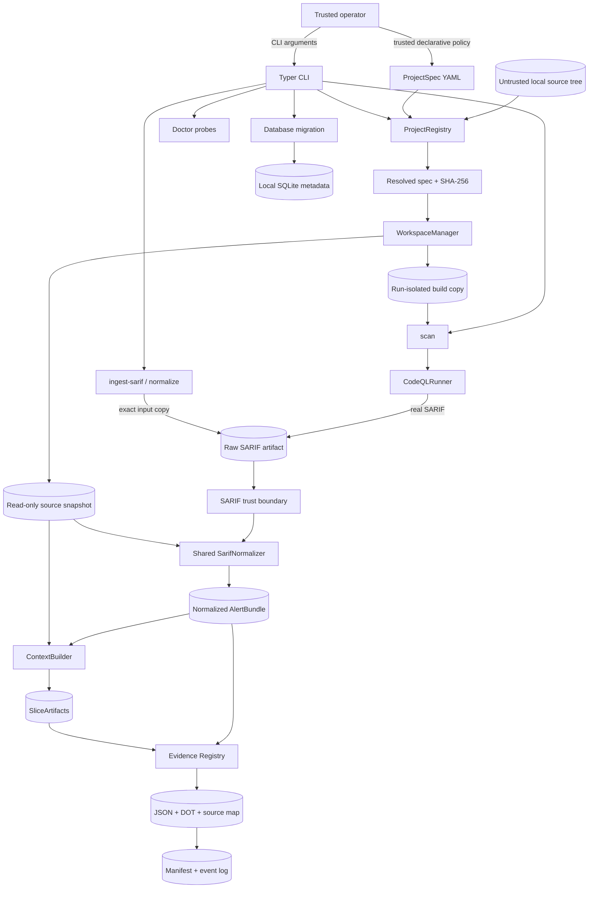

# Gate C context/evidence architecture

## Status and scope

This document describes the executable Gate A foundation, Gate B CodeQL/SARIF
input layer, and Gate C context/evidence layer. The current system makes target
selection, filesystem ownership, external-tool execution, raw-input provenance,
SARIF normalization, bounded source extraction, evidence references, and
per-run audit state explicit before any model call is introduced.

The checked-in implementation includes:

- a Python 3.12 `src/` package and Typer CLI;
- strict ProjectSpec loading and registry lookup;
- local-source validation, stable resolved-configuration digests, managed
  copy-only content-addressed snapshots, and run-isolated writable copies;
- minimal SQLite metadata storage and environment diagnostics;
- a Maven Wrapper-only CodeQL command builder/runner;
- bounded existing-SARIF ingest plus strict parsing of the supported SARIF
  2.1.0 subset;
- deterministic normalized alert/path contracts and generated JSON Schemas;
- bounded Level 0 normalized metadata and Level 1 fixed-window/lexical Java
  callable slices, one strict `SliceArtifact` per alert occurrence;
- a closed Evidence Registry whose items cite registered artifacts, Claim
  reference validation, a deterministic DOT graph, and escaped source-map HTML;
- exact raw SARIF preservation, snapshot-file hash verification, finalized
  registered artifacts, an append-only workflow event log, and a current/final
  run manifest;
- original Golden SARIF inputs and offline unit/integration/security tests.

Gate C does **not** call an LLM, generate claims, classify an alert, publish a
decision report, or modify/dismiss an upstream CodeQL alert.
A real Java/CodeQL smoke completed in one development environment and is
recorded in the dated evidence log. Its zero-result SARIF validates the external
runner path but does not establish findings or clean-room reproducibility.

## System context



The operator controls ProjectSpec and input paths but may still make mistakes,
so both are validated strictly. Target source and SARIF are untrusted. Writable
state becomes application-owned only after canonical containment and symlink
checks. Offline Golden input and real CodeQL output cross the same parse/
normalize boundary; only their recorded source kind and tool provenance differ.

## Component responsibilities

| Component | Current responsibility | Must not do |
| --- | --- | --- |
| CLI | Parse commands, select JSON/human output, map typed errors to stable non-zero exits | Hide errors, fabricate tool success, duplicate normalization rules |
| configuration/domain models | Reject unknown public fields, validate semantic constraints, define strict frozen top-level public records | Perform I/O or accept secrets/tool-permission overrides |
| `ProjectRegistry` | Resolve local ProjectSpec consistently, validate trust roots, compute a deterministic digest | Special-case fixtures or mutate source |
| `WorkspaceManager` | Allocate owned per-run paths, create/reverify a copy-only snapshot, create a distinct writable build copy | Write into the original source, follow escaping links, delete broad roots |
| `CodeQLRunner` | Validate wrapper/JDK/pack pins, require same-JDK Java/`javac`, construct argv/environment, create/analyze a database, record commands/logs/results | Use a shell, inherit credential/proxy environment variables, accept repository/model text as commands, report a failed tool as success |
| SARIF parser/normalizer | Bound and parse raw bytes, resolve snapshot paths, independently hash existing files, preserve occurrences, emit deterministic domain records | Fetch URIs, invent missing files/facts, deduplicate alerts or paths |
| `ContextBuilder` | Consume normalized locations, safely open bounded snapshot files, validate coordinates, select fixed-window or lexical Java callable context, record token/omission metadata | Reparse SARIF paths, read the whole repository, execute source text, claim AST/CFG semantics |
| Evidence Registry/exporters | Bind evidence to registered artifact hashes and raw result references, reject dangling artifact/evidence/claim IDs, export deterministic JSON/DOT and escaped source navigation | Treat names/comments as facts, generate a verdict, accept unknown evidence IDs, emit active HTML content |
| `RunJournal` | Register config/descriptor and run artifacts, hash/reverify/finalize content, validate states, append events, publish a current/final manifest | Overwrite named artifacts, leave a failed run marked successful, claim the manifest itself is append-only |
| diagnostics | Report versions/availability and configuration/storage readiness | Treat “not installed” as a successful scan or log secrets |
| storage/migration | Initialize the minimal SQLite metadata schema through SQLAlchemy | Claim normalized-alert indexing, PostgreSQL, or team-service semantics |

## ProjectSpec and build boundary

ProjectSpec remains the sole way core code learns which target to analyze.
Adding a local target changes `configs/projects/<project-id>.yaml`; it does not
change the registry, workspace, SARIF, or runner domain logic.

Important invariants are:

1. Project IDs are safe slugs and unknown public configuration fields are
   rejected.
2. Only an existing local source directory can be acquired. A future Git source
   may be represented in schema but has no acquisition adapter at this gate;
   local `snapshot_mode` is copy-only.
3. Source and storage paths are canonicalized; project-selected writable paths
   must remain below trusted workspace/artifact roots.
4. The build command is a non-empty immutable argument sequence. Gate B accepts
   only the Maven adapter with `./mvnw` or `./mvnw.cmd`; bare host Maven,
   Gradle, explicit commands, shells, and inline interpreters are rejected.
5. The wrapper must be a checked-in regular executable below the copied build
   root and cannot be a symlink escape. The two fixtures use the upstream Apache
   Maven Wrapper 3.3.4 `only-script` launcher, declare Maven 3.9.9 and its
   distribution SHA-256 through a credential-free exact-release HTTPS URL, and
   pass Maven `--offline`. The runner validates those declarations but does not
   attest an already cached Maven runtime.
6. ProjectSpec cannot contain API keys, model endpoints, system prompts, or
   permission overrides.
7. Optional CodeQL query/model packs require exact `scope/name@x.y.z` pins;
   option-like, traversal, absolute, URI, and unpinned inputs are rejected.
8. A resolved secret-free canonical representation has a stable SHA-256 and is
   captured as a registered run artifact alongside the workspace ownership
   descriptor.

YAML and repository prose are data. The CodeQL `database create --command`
value is serialized only from validated build argv with platform-aware quoting;
it is not concatenated from source comments, build output, SARIF, or a model.

## Workspace and artifact ownership

Logical runtime paths follow this structure:

```text
workspaces/
├── sources/<snapshot-id>/
├── build-copies/<run-id>/
├── codeql-databases/<run-id>/
├── temporary/<run-id>/
└── locks/

artifacts/
└── runs/<run-id>/
    ├── .evitriage-workspace.json
    ├── project-spec.resolved.yaml
    ├── workflow-events.jsonl
    ├── run-manifest.json
    ├── metadata/error.json             # failed run
    ├── input/source.sarif              # existing-SARIF branch
    ├── codeql/results.sarif            # real-scan branch
    ├── codeql/*.command.json
    ├── codeql/*.stdout.log
    ├── codeql/*.stderr.log
    ├── normalized/alerts.json
    ├── context/index.json
    ├── context/slices/run-<run>-result-<result>.json
    ├── context/source-map.html
    ├── evidence/registry.json
    └── evidence/graph.dot
```

The original source directory is input-only. A content-addressed copy snapshot
is reverified before creating each distinct writable build copy. Before
reading, creating, copying, registering, or cleaning a path, adapters enforce
canonical containment and reject traversal and symlinks at trust boundaries.
Inputs and SARIF outputs are bounded regular files; recorded artifact identities
use SHA-256.

`workflow-events.jsonl` is created exclusively and appended after every valid
transition. `run-manifest.json` is a current projection rewritten as artifacts,
versions, and events are recorded. Before either successful or failed
finalization, every registered artifact is reopened, checked against its
recorded size/SHA-256, and changed to owner-read-only (`0400`); the event log and
final manifest are also `0400`. Thus the event file is the append-only history
while the manifest is the convenient current/final summary.

This is currently a single-process, newly allocated run journal. The CLI has no
idempotency key or caller-selected run ID, and a pre-existing event/manifest
pair is rejected rather than recovered. Terminal events retain the typed error
code and link the registered, redacted `metadata/error.json` digest. Recognized
CodeQL command metadata and bounded logs produced before a runner failure are
registered before the failed run is finalized.

## Gate B/C command flows

### Existing SARIF ingest and explicit normalize

```text
CLI operator path + validated ProjectSpec
  → managed source snapshot and per-run paths
  → bounded, no-follow regular-file read
  → exact raw-byte copy + SHA-256
  → strict SARIF 2.1.0 parse
  → snapshot-bound location resolution
  → hash each existing regular snapshot file; reject conflicting SARIF hash
  → shared deterministic normalizer
  → normalized/alerts.json + artifact SHA-256
  → per-alert Level 0/1 SliceArtifact + source-coordinate validation
  → Evidence Registry + DOT graph + escaped source map
  → terminal CONTEXT_READY manifest
```

`ingest-sarif` and `normalize` intentionally share this implementation. They
exist as separate operator commands, not as different interpretations of SARIF.
Neither command starts Java, Maven, or CodeQL.

### Real CodeQL scan

```text
validated ProjectSpec + managed build copy
  → safe Maven Wrapper plan + exact release URL/SHA declaration
  → discover CodeQL, Java, and javac
  → verify pinned CodeQL and same-JDK configured Java/javac major versions
  → resolve the Java security-extended alias to its bundle-pinned suite
  → validate exact optional query/model pack pins
  → pass only the non-secret subprocess environment allowlist
  → CodeQL database create with timeout
  → CodeQL database analyze to managed SARIF with timeout
  → record command argv, exit, duration, redacted logs, and hashes
  → validate/register raw SARIF
  → the same parser, normalizer, context builder, and evidence registry as ingest
  → terminal CONTEXT_READY manifest
```

Every external invocation uses `shell=False`. CodeQL/Java/`javac` absence, a
version mismatch, timeout, non-zero exit, missing or unsafe output, and invalid
SARIF are typed failures. They end in `CODEQL_FAILED` or `INVALID_SARIF`, retain
structured error/partial tool artifacts, and never produce a successful
summary. The real runner is tested with controlled process doubles; the dated
evidence log separately records one environment-specific real external smoke.

### State convergence

```text
CREATED → PROJECT_VALIDATED → WORKSPACE_READY → SOURCE_READY
  ├─→ SARIF_INGESTED ────────────────────────────────┐
  └─→ BUILD_READY → CODEQL_DB_READY → SCANNED ──────┤
                                                     └─→ NORMALIZED
                                                          └─→ CONTEXT_READY

Terminal failures: INVALID_SARIF, CODEQL_FAILED, CONTEXT_INCOMPLETE
```

Both successful branches converge before context/evidence processing. Gate C
consumes the normalized bundle and its raw provenance; it does not branch on
Golden versus real input to create two evidence systems.

## Normalized SARIF contract

The raw document is parsed as UTF-8 JSON with duplicate object keys and
non-finite numbers rejected. The supported SARIF models retain runs, driver
rules, results, artifacts, URI bases, primary/additional/related locations,
thread-flow paths, messages, properties, fingerprints, and partial
fingerprints. Unknown SARIF extension fields are ignored rather than allowed to
change domain behavior. A run with results must declare `columnKind` as either
`utf16CodeUnits` or `unicodeCodePoints`; the value is retained on every
normalized source location.

The selected source snapshot supplies a safe root for URI interpretation. This
is a containment boundary, not proof that the snapshot revision produced the
SARIF: a safely contained referenced path may be absent at Gate B, and source/
SARIF correspondence remains operator-supplied provenance. When the path names
an existing regular file, the normalizer computes its SHA-256 independently and
rejects a conflicting SARIF assertion; an absent path remains allowed and has
no verified normalized artifact digest.

Normalization has the following semantics:

- every source path is snapshot-relative POSIX text;
- local/file URI bases and Windows drive paths are normalized without fetching
  content; CodeQL's exact case-insensitive `%SRCROOT%` convention maps only to
  the validated snapshot root, while other undeclared bases fail closed;
- parent traversal, remote schemes/authorities, UNC paths, control characters,
  source-root escape, and snapshot symlinks fail closed;
- all runs, results, code flows, thread flows, and repeated occurrences remain
  in input order; duplicate alerts and duplicate paths are not collapsed;
- a missing `codeFlows` remains an explicit pathless alert and a missing
  snippet remains unknown rather than invented;
- coordinates must be positive and ordered; an omitted region `endLine` uses
  SARIF's same-line default when `endColumn` is present. Gate C checks line/
  column bounds in the declared SARIF column unit before including an existing
  source file and records other cases as partial;
- stable domain-separated SHA-256 values identify normalized alerts and paths;
- every alert points back to the exact raw artifact by SHA-256, `run_index`,
  and `result_index`.

An existing file's normalized artifact digest is independently verified rather
than copied from SARIF. For a missing file it is `null`, even if SARIF declares
a hash. Gate C rechecks available file content/coordinates before extracting a
slice. The primary Golden fixture is aligned to the checked-in
`PathReader.java` path, line positions, snippet, and SHA-256, but it remains
synthetic rather than real CodeQL output.

The domain layer sees strict, frozen top-level alert, context, evidence, claim,
triage, manifest, and summary models, not raw vendor dictionaries. JSON Schemas
for ProjectSpec, `AlertBundle`, `SliceArtifact`, `ContextIndex`,
`EvidenceRegistry`, LLM/Agent outputs, `FinalDecision`, `TriageResult`,
`RunManifest`, and CLI summaries are generated and checked for drift.

## Gate C context and evidence contract

`ContextBuilder` consumes only `AlertBundle` primary, additional, related, and
path locations plus the validated source snapshot. It opens no-follow regular
files up to 1 MiB, accepts UTF-8 text, checks the normalized digest and line/
column bounds using each location's declared measurement, and never scans
unrelated repository files. `path_function_slice` uses a brace/comment/string-aware
lexical Java callable boundary finder; unresolved syntax falls back to a five-
line window and records the precision loss. `fixed_window` is independently
executable. `adaptive_slice` fails explicitly because it belongs to V0.3+.

Each alert occurrence receives one canonical `SliceArtifact`, including Level
0 rule/message/primary/additional/related/path facts, selected source ranges
and content hashes, raw SARIF reference, token estimate, completeness, and
omissions. The default budget is
24,000 estimated tokens using a deterministic UTF-8 byte heuristic. Missing,
binary, oversized, changed, out-of-bounds, and over-budget context remains
`partial`; no source text or path edge is invented.

The Evidence Registry allowlists cited artifact hashes and binds every item to
an alert fingerprint plus exact raw result reference. CodeQL paths are medium
supporting observations, not exploitability proof. Repository excerpts and
lexical guard/sanitizer matches are neutral. Relationship endpoints, Claim
evidence IDs, and artifact hashes must resolve inside the registry. Gate C
generates no Claims; those contracts are the fail-closed boundary for Gate D.
DOT and HTML exports contain the same validated identities, while HTML escapes
all untrusted text and contains no script or verdict.

## Failure, observability, and remaining security boundary

Expected failures use a typed exception hierarchy and are translated once at
the CLI boundary into structured JSON and stable non-zero exits. A run that has
allocated audit storage attaches its run ID/root to failure details and writes
the redacted structured error artifact, registers recognized partial CodeQL
metadata/logs, links the error digest from the terminal event, and writes the
failed manifest before re-raising the operational error.

Logs and records use UTC timestamps, stable identifiers, bounded/redacted
persisted output, and content hashes rather than dumping source or complete
secret-bearing environments. External tools receive an explicit allowlist of
basic platform/path/locale variables, excluding API/GitHub/SSH/proxy
credentials. Raw SARIF is preserved as a controlled artifact because later
claims must remain traceable; it is never interpreted as an instruction.

The environment allowlist is not filesystem isolation. It retains basic host
variables including `HOME`, and the same-user build can read files permitted to
that account. A real scan therefore needs a disposable/external sandbox even
when no credential variables are inherited.

Managed paths, wrapper validation, argument vectors, and timeouts reduce risk
but are not a complete operating-system sandbox. The checked-in build is
offline at the Maven layer, yet the runner starts `mvnw` as the host user. It
does not enforce an OS network namespace or CPU/memory/process-count quotas;
captured output is not memory-bounded; and timeout handling does not prove every
descendant process has terminated. Only trusted fixtures/repositories should be
scanned unless external network/resource/process isolation is supplied. A Maven
Wrapper cache bootstrap is a separate controlled supply-chain step.

## Bounded Gate D offline triage

Gate D may consume only the completed normalized bundle, validated Gate C
context/evidence artifacts, manifest identities, and raw result references. It
must not introduce new facts outside the registry, accept dangling evidence
IDs, or create a branch-specific downstream workflow.

The current core consumes an immutable `EvidenceRegistry` plus an exact alert
fingerprint/raw-result reference. `FakeLLM`, `ReplayLLM`, and the optional
`DeepSeekLLM` implement the same provider-neutral `StructuredLLM` protocol and
strict response validation. The canonical request hash covers prompt, payload,
response schema, Agent role, profile/model, and decoding/data-policy fields.
Replay reads only a bounded regular `<request-sha256>.json` file without
following symlinks.

`TriageWorkflow` calls Analyst, Rebuttal, and Judge in that order. Code assigns
stable Claim IDs after validating each draft's evidence references against the
exact alert occurrence. Each role gets at most one repair and the whole alert at
most six calls. Source/SARIF excerpts remain nested under
`untrusted_code_data`; the fixed system prompts declare those bytes inert and
grant no tools.

The deterministic policy treats Judge output as a candidate: TP needs critical
supported Analyst claims for attacker control, path feasibility, and dangerous
sink semantics, each backed by matching medium-or-stronger evidence, or a
decisive successful verification; FP needs a critical rebutted Rebuttal claim
with decisive FP evidence. Empty critical evidence, unknowns, unresolved
critical claims, and high/decisive conflicts become NMC. Confidence cannot
bypass these checks and automatic dismissal is structurally disabled.

`evitriage triage` binds ProjectSpec, existing SARIF, and a trusted profile. A
Replay profile additionally requires a read-only cache. It allocates a fresh
run, reuses the same
normalization/context/evidence functions as `ingest-sarif`, and then persists
three strict artifacts: `triage/analyst.json` and `triage/rebuttal.json` with
role `model`, followed by `triage/judged.json` with role `decision`. Their hashes
anchor the append-only transitions `ANALYZED → REBUTTED → JUDGED`; finalization
revalidates and makes all registered artifacts owner-read-only.

Operational run identity remains unique for each managed execution. Normalized
alerts, context, Evidence Registry, and model invocation context instead use a
stable `analysis_identity` derived from the source-tree digest, raw-SARIF
digest, commit, and normalizer version. This distinction prevents a fresh
workspace ID from invalidating an otherwise equivalent Replay request while
preserving separate execution journals.

The pipeline records the complete trusted profile digest and model ID in the
manifest, and persists only fixed prompts' hashes and validated responses inside
the stage/decision records; it does not persist raw prompts or copy Replay cache
entries. Missing Replay input becomes a finalized `MODEL_FAILED` run with
bounded non-content request provenance. Profile mismatch or an evidence-policy
violation becomes `POLICY_REJECTED`. Existing finalized Gate C runs are not
reopened. Prior-run continuation, direct scan-to-triage chaining, a trusted
cache producer, and JSONL/HTML publication remain Gate E boundaries.

The DeepSeek path is a deliberate post-Gate-D remote extension. Its adapter
fixes the target to `api.deepseek.com:443/chat/completions`, accepts only V4-Pro
or V4-Flash, requests JSON Output with thinking disabled, and supplies no tools.
It reads the Bearer credential from either the one-process
`DEEPSEEK_API_KEY` input or a fixed repository-external TPM2/systemd encrypted
blob. Enrollment and decryption use pipes, so no plaintext credential file is
created. The credential is not part of the messages or persisted provenance,
and non-success response bodies are discarded. Before normalization or a model call, the pipeline
requires both the trusted profile and ProjectSpec to say
`remote_llm_allowed`; existing offline projects cannot silently transmit their
evidence. ADR 0006 records the data-governance and secret-handling decision.

## Verification strategy

Current acceptance evidence consists of:

- Ruff formatting/linting, mypy strict checks, generated-schema consistency,
  pytest, and branch-aware coverage through `make check`;
- Gate A tests for strict config, stable digests, workspace isolation, source
  immutability, storage, diagnostics, traversal/symlink defense, and cleanup;
- Golden tests for single/multiple/absent paths, duplicates, missing fields,
  multi-run references, Windows URI bases, malformed coordinates, and hostile
  URIs, plus existing/missing/conflicting source-file hashes;
- runner tests for argv construction, managed wrapper/path enforcement,
  CodeQL/Java/`javac` versions, Maven URL/SHA declarations, exact qlpack pins,
  command artifacts, timeouts, non-zero exits, missing tools, and pre-existing
  outputs;
- integration tests proving offline ingest and controlled real-runner output
  converge on the same normalizer, context/evidence builders, and audit state
  machine, including structured failed-run artifacts;
- Gate C unit/security tests for callable/window selection, token omissions,
  missing and symlinked source, unsupported adaptive context, content hashes,
  dangling relationship/claim/artifact references, and DOT/HTML navigation;
- Gate D unit/security tests for Fake TP/FP/NMC decisions, complete Replay,
  evidence/claim closure and bounded repair, request hashes, prompt-injection
  containment, and cache miss/symlink/strict-JSON failures;
- Gate D integration tests that materialize deterministic temporary Replay
  entries, reach `JUDGED` through all durable states, revalidate decision
  artifacts, and prove a Replay miss finalizes as `MODEL_FAILED` with request
  provenance;
- simulated-HTTPS DeepSeek tests for the exact official host/path, JSON schema
  payload, complete three-role CLI flow, missing-key/error-body non-disclosure,
  offline-project rejection, and commit-eligible secret scanning; no live key
  or paid request is used by acceptance tests;
- a separately authorized 2026-07-23 DeepSeek smoke using the repository-
  external TPM2 credential, recorded as ignored run
  `20260722T174132749958Z-8fce5d0ab3f9`; its three accepted calls and `JUDGED`
  state are narrow live-path evidence rather than a checked-in test fixture or
  model-quality benchmark;
- a real offline CLI ingest, an actual missing-CodeQL `scan` failure, and a
  successful pinned Java/CodeQL smoke, recorded with commands, exit codes, and
  artifact hashes in the dated progress log.

The recorded external Java/CodeQL smoke is environment-specific. A hosted CI
result and clean-room reproduction remain separate evidence that must be
recorded honestly when those environments exist.
