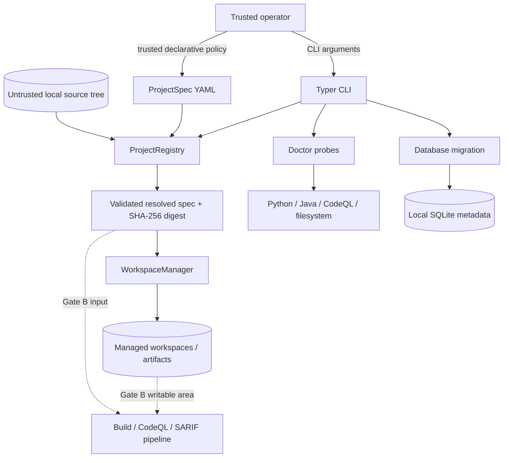

# Gate A architecture

## Status and scope

This document describes the executable Gate A foundation of EviTriage-QL. Its
purpose is to make target selection, file-system ownership, diagnostics, and
metadata storage explicit before any untrusted build or CodeQL process is
introduced.

Gate A includes:

- a Python 3.12 `src/` package and Typer CLI;
- strict ProjectSpec loading and registry lookup;
- local-source semantic validation and stable resolved-configuration digests;
- managed, run-isolated workspace paths;
- structured errors/logging and environment diagnostics;
- a minimal SQLite schema and migration entry point;
- two local Java fixtures/configurations and offline quality checks.

Gate A does **not** run a target build or CodeQL, parse SARIF, construct program
context/evidence, call an LLM, classify an alert, or publish a report. The later
pipeline is shown only as an architectural boundary.

## System context



The operator controls the ProjectSpec but may still make mistakes, so it is
validated strictly. The target source tree is always untrusted. Tool discovery
is read-only. Runtime state is application-owned only after canonical path and
containment checks succeed.

## Component responsibilities

| Component | Gate A responsibility | Must not do |
| --- | --- | --- |
| CLI | Parse commands, select JSON/human output, map typed errors to stable non-zero exits | Hide errors, fabricate external-tool success, duplicate business rules |
| configuration/domain models | Parse strict typed data, reject extra fields, enforce local P0 constraints | Perform I/O or accept secrets/tool-permission overrides |
| `ProjectRegistry` | Load a named/file ProjectSpec, resolve it consistently, validate semantics, compute a deterministic digest | Special-case either example fixture or mutate the source |
| `WorkspaceManager` | Derive/create owned per-run paths below configured roots, lock allocation, copy to a writable build area when requested, clean only owned run paths | Write into the original source, follow an escaping symlink, delete a broad root |
| diagnostics | Report versions/availability and configuration/storage readiness as structured data | Treat “not installed” as a successful scan or log secrets |
| storage/migration | Initialize the minimal SQLite metadata schema through SQLAlchemy | Claim PostgreSQL/team-service support or infer research results from log text |
| logging/errors | Emit machine-actionable categories and redacted context | Swallow exceptions or serialize credentials/source contents unnecessarily |

## ProjectSpec boundary

ProjectSpec is the sole way core code learns which target to analyze. Adding a
new local target changes `configs/projects/<project-id>.yaml`; it does not change
the registry, workspace, or domain packages.

The Gate A schema reserves the research identity and policy groups required by
the v0.1 design:

- schema version and project identity (`id`, display name, language, license
  hint);
- local source identity and snapshot/clean-tree/submodule policy;
- build adapter, working directory, JDK, argument-vector command, timeout, and
  network policy;
- pinned CodeQL language/version/query metadata;
- analysis context/workflow/profile selection;
- security policy such as source upload/build network;
- managed workspace and artifact roots.

Important invariants:

1. Project IDs are safe slugs and unknown fields are rejected.
2. Gate A can acquire/materialize only an existing local source directory. The
   schema may validate a pinned future Git/dataset identity, but it has no Gate A
   acquisition adapter; a future Git run must use a full 40-character commit.
3. Source and storage paths are canonicalized before containment decisions;
   project-selected storage must remain below trusted workspace/artifact roots.
4. A build command is a non-empty immutable argument sequence, never a shell
   string. Gate A accepts only Maven declarations with a Maven executable;
   Gradle/explicit adapters and direct or wrapped shell execution are rejected.
5. ProjectSpec cannot contain API keys, model endpoints, system prompts, or tool
   permission overrides.
6. A resolved representation is secret-free, serialized canonically, and
   identified by SHA-256 so a later run can record exactly what it used.

YAML is loaded as data. Repository text is never evaluated while validating a
configuration.

## Workspace ownership model

Logical runtime paths follow this structure:

```text
workspaces/
├── sources/<snapshot-id>/
├── build-copies/<run-id>/
├── codeql-databases/<run-id>/
├── temporary/<run-id>/
└── locks/

artifacts/
└── runs/<run-id>/
```

Only the selected local source directory is outside this ownership tree, and it
is input-only. A run receives a unique writable build copy and output paths. A
read-only snapshot is content-addressed and reused; its digest is verified again
before every new build copy. Writable build directories are never shared
between runs.

Before creating, copying, locking, or cleaning a path, the manager verifies that
the canonical target remains below the configured canonical root. Root
validation is side-effect free until a source is proven not to overlap either
managed tree. Run IDs and project IDs are validated as safe path components. A
symlink or parent-traversal segment cannot be used to escape a root. Cleanup is
limited to the current owned run paths; it is never implemented as a broad
recursive delete of a user-supplied path. Ownership descriptors gate cleanup,
managed directories are owner-only, and snapshot/build permissions never widen
access to private source files. Source traversal is iterative and bounded by
entry-count, depth, per-file, and total-byte limits.

Allocation and preparation are separate concepts: callers can derive/validate
the plan before materializing it. This keeps configuration validation safe and
makes file-system behavior independently testable.

## Gate A command flows

### Project validation

```text
CLI path
  → safe YAML load
  → strict Pydantic parse
  → semantic/path validation
  → canonical secret-free representation
  → SHA-256 digest
  → JSON or human result
```

Both checked-in example configs use this exact flow. A validation failure has a
typed configuration/path error and non-zero exit; it is not silently coerced.

### Workspace preparation

```text
resolved ProjectSpec + validated run identity
  → canonical managed roots
  → containment/symlink checks
  → lock
  → isolated path allocation
  → optional controlled local-source copy
  → immutable RunWorkspace descriptor
```

Tests verify distinct configurations/runs do not share writable directories and
that fixture trees are unchanged.

### Doctor

Doctor performs bounded probes and emits one structured document. Executable
discovery/version probes are read-only; managed-root readiness checks may create
the configured roots and a short-lived probe file within them. Python and
package information are required for Gate A. Java and CodeQL are reported
because they are future scan prerequisites; their absence is explicit and is
never turned into a synthetic scan result. The command must redact any
environment values it includes.

### Database migration

The default backend is a local SQLite database. SQLAlchemy owns engine/session
behavior and the migration command creates the minimal Gate A tables. Domain
objects do not open database connections. The schema is a metadata substrate,
not evidence that the downstream alert workflow exists.

## Failure and observability model

Expected failures are represented by a project-specific exception hierarchy,
then translated once at the CLI boundary into structured output and a stable
exit status. Configuration, unsafe path, workspace, storage, and missing-tool
conditions remain distinguishable. Unexpected exceptions may retain diagnostic
context for developers but must not expose secrets to normal JSON output.

Logs are structured, use UTC timestamps, and attach identifiers/digests rather
than dumping target source or whole configurations. Secrets are redacted by key
and future providers must keep raw requests/responses outside Git.

## Gate boundary and extension points

Gate B may consume only a validated resolved ProjectSpec and RunWorkspace. Its
CodeQL runner will be an adapter that receives validated argument vectors and
records the real command, version, exit status, duration, and artifacts. Scan
and future `ingest-sarif` inputs must converge before normalization rather than
creating duplicate downstream pipelines.

Later components—SARIF normalizer, path-function context, evidence registry,
provider-neutral Fake/Replay LLM, bounded agents, deterministic decision policy,
and escaped JSONL/HTML reporting—must preserve these Gate A boundaries. Their
interfaces may be documented, but unavailable implementations must raise a
clear feature-not-available error instead of returning placeholders.

## Verification strategy

Gate A acceptance evidence consists of:

- Ruff formatting/linting and mypy strict checks;
- unit tests for strict models, digests, registry, paths, errors, logging, and
  storage;
- integration tests validating both local configs through one code path;
- workspace isolation, source immutability, traversal/symlink, locking, and
  cleanup tests;
- CLI tests for JSON output and meaningful failures;
- `uv sync --all-extras`, `make check`, and `evitriage doctor --json` with real
  exit codes recorded in the dated progress log.
