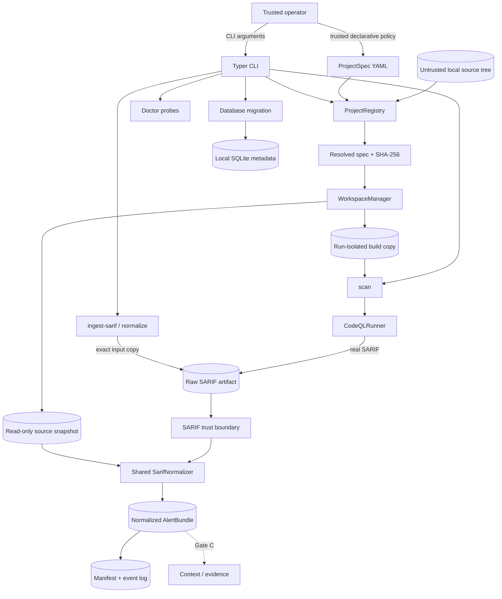

# Gate B input-layer architecture

## Status and scope

This document describes the executable Gate A foundation and Gate B CodeQL/
SARIF input layer. The current system makes target selection, filesystem
ownership, external-tool execution, raw-input provenance, SARIF normalization,
and per-run audit state explicit before any context extraction or model call is
introduced.

The checked-in implementation includes:

- a Python 3.12 `src/` package and Typer CLI;
- strict ProjectSpec loading and registry lookup;
- local-source validation, stable resolved-configuration digests, managed
  copy-only content-addressed snapshots, and run-isolated writable copies;
- minimal SQLite metadata storage and environment diagnostics;
- a Maven Wrapper-only CodeQL command builder/runner;
- bounded existing-SARIF ingest plus strict parsing of the supported SARIF
  2.1.0 subset;
- deterministic normalized alert/path contracts and generated JSON Schemas;
- exact raw SARIF preservation, snapshot-file hash verification, finalized
  registered artifacts, an append-only workflow event log, and a current/final
  run manifest;
- original Golden SARIF inputs and offline unit/integration/security tests.

Gate B does **not** construct program context or evidence, call an LLM,
classify an alert, publish a report, or modify/dismiss an upstream CodeQL alert.
A real Java/CodeQL smoke is also unverified in the current environment because
the required external tools are absent.

## System context



The operator controls ProjectSpec and input paths but may still make mistakes,
so both are validated strictly. Target source and SARIF are untrusted. Writable
state becomes application-owned only after canonical containment and symlink
checks. Offline Golden input and real CodeQL output cross the same parse/
normalize boundary; only their recorded source kind and tool provenance differ.

## Component responsibilities

| Component | Current responsibility | Must not do |
| --- | --- | --- |
| CLI | Parse commands, select JSON/human output, map typed errors to stable non-zero exits | Hide errors, fabricate tool success, duplicate normalization rules |
| configuration/domain models | Reject unknown public fields, validate semantic constraints, define strict frozen top-level public records | Perform I/O or accept secrets/tool-permission overrides |
| `ProjectRegistry` | Resolve local ProjectSpec consistently, validate trust roots, compute a deterministic digest | Special-case fixtures or mutate source |
| `WorkspaceManager` | Allocate owned per-run paths, create/reverify a copy-only snapshot, create a distinct writable build copy | Write into the original source, follow escaping links, delete broad roots |
| `CodeQLRunner` | Validate wrapper/JDK/pack pins, require same-JDK Java/`javac`, construct argv/environment, create/analyze a database, record commands/logs/results | Use a shell, inherit credential/proxy environment variables, accept repository/model text as commands, report a failed tool as success |
| SARIF parser/normalizer | Bound and parse raw bytes, resolve snapshot paths, independently hash existing files, preserve occurrences, emit deterministic domain records | Fetch URIs, invent missing files/facts, deduplicate alerts or paths |
| `RunJournal` | Register config/descriptor and run artifacts, hash/reverify/finalize content, validate states, append events, publish a current/final manifest | Overwrite named artifacts, leave a failed run marked successful, claim the manifest itself is append-only |
| diagnostics | Report versions/availability and configuration/storage readiness | Treat “not installed” as a successful scan or log secrets |
| storage/migration | Initialize the minimal SQLite metadata schema through SQLAlchemy | Claim normalized-alert indexing, PostgreSQL, or team-service semantics |

## ProjectSpec and build boundary

ProjectSpec remains the sole way core code learns which target to analyze.
Adding a local target changes `configs/projects/<project-id>.yaml`; it does not
change the registry, workspace, SARIF, or runner domain logic.

Important invariants are:

1. Project IDs are safe slugs and unknown public configuration fields are
   rejected.
2. Only an existing local source directory can be acquired. A future Git source
   may be represented in schema but has no acquisition adapter at this gate;
   local `snapshot_mode` is copy-only.
3. Source and storage paths are canonicalized; project-selected writable paths
   must remain below trusted workspace/artifact roots.
4. The build command is a non-empty immutable argument sequence. Gate B accepts
   only the Maven adapter with `./mvnw` or `./mvnw.cmd`; bare host Maven,
   Gradle, explicit commands, shells, and inline interpreters are rejected.
5. The wrapper must be a checked-in regular executable below the copied build
   root and cannot be a symlink escape. The two fixtures use the upstream Apache
   Maven Wrapper 3.3.4 `only-script` launcher, declare Maven 3.9.9 and its
   distribution SHA-256 through a credential-free exact-release HTTPS URL, and
   pass Maven `--offline`. The runner validates those declarations but does not
   attest an already cached Maven runtime.
6. ProjectSpec cannot contain API keys, model endpoints, system prompts, or
   permission overrides.
7. Optional CodeQL query/model packs require exact `scope/name@x.y.z` pins;
   option-like, traversal, absolute, URI, and unpinned inputs are rejected.
8. A resolved secret-free canonical representation has a stable SHA-256 and is
   captured as a registered run artifact alongside the workspace ownership
   descriptor.

YAML and repository prose are data. The CodeQL `database create --command`
value is serialized only from validated build argv with platform-aware quoting;
it is not concatenated from source comments, build output, SARIF, or a model.

## Workspace and artifact ownership

Logical runtime paths follow this structure:

```text
workspaces/
├── sources/<snapshot-id>/
├── build-copies/<run-id>/
├── codeql-databases/<run-id>/
├── temporary/<run-id>/
└── locks/

artifacts/
└── runs/<run-id>/
    ├── .evitriage-workspace.json
    ├── project-spec.resolved.yaml
    ├── workflow-events.jsonl
    ├── run-manifest.json
    ├── metadata/error.json             # failed run
    ├── input/source.sarif              # existing-SARIF branch
    ├── codeql/results.sarif            # real-scan branch
    ├── codeql/*.command.json
    ├── codeql/*.stdout.log
    ├── codeql/*.stderr.log
    └── normalized/alerts.json
```

The original source directory is input-only. A content-addressed copy snapshot
is reverified before creating each distinct writable build copy. Before
reading, creating, copying, registering, or cleaning a path, adapters enforce
canonical containment and reject traversal and symlinks at trust boundaries.
Inputs and SARIF outputs are bounded regular files; recorded artifact identities
use SHA-256.

`workflow-events.jsonl` is created exclusively and appended after every valid
transition. `run-manifest.json` is a current projection rewritten as artifacts,
versions, and events are recorded. Before either successful or failed
finalization, every registered artifact is reopened, checked against its
recorded size/SHA-256, and changed to owner-read-only (`0400`); the event log and
final manifest are also `0400`. Thus the event file is the append-only history
while the manifest is the convenient current/final summary.

This is currently a single-process, newly allocated run journal. The CLI has no
idempotency key or caller-selected run ID, and a pre-existing event/manifest
pair is rejected rather than recovered. Terminal events retain the typed error
code and link the registered, redacted `metadata/error.json` digest. Recognized
CodeQL command metadata and bounded logs produced before a runner failure are
registered before the failed run is finalized.

## Gate B command flows

### Existing SARIF ingest and explicit normalize

```text
CLI operator path + validated ProjectSpec
  → managed source snapshot and per-run paths
  → bounded, no-follow regular-file read
  → exact raw-byte copy + SHA-256
  → strict SARIF 2.1.0 parse
  → snapshot-bound location resolution
  → hash each existing regular snapshot file; reject conflicting SARIF hash
  → shared deterministic normalizer
  → normalized/alerts.json + artifact SHA-256
  → terminal NORMALIZED manifest
```

`ingest-sarif` and `normalize` intentionally share this implementation. They
exist as separate operator commands, not as different interpretations of SARIF.
Neither command starts Java, Maven, or CodeQL.

### Real CodeQL scan

```text
validated ProjectSpec + managed build copy
  → safe Maven Wrapper plan + exact release URL/SHA declaration
  → discover CodeQL, Java, and javac
  → verify pinned CodeQL and same-JDK configured Java/javac major versions
  → validate exact optional query/model pack pins
  → pass only the non-secret subprocess environment allowlist
  → CodeQL database create with timeout
  → CodeQL database analyze to managed SARIF with timeout
  → record command argv, exit, duration, redacted logs, and hashes
  → validate/register raw SARIF
  → the same parser and normalizer as ingest
  → terminal NORMALIZED manifest
```

Every external invocation uses `shell=False`. CodeQL/Java/`javac` absence, a
version mismatch, timeout, non-zero exit, missing or unsafe output, and invalid
SARIF are typed failures. They end in `CODEQL_FAILED` or `INVALID_SARIF`, retain
structured error/partial tool artifacts, and never produce a successful
summary. The real runner is tested with controlled process doubles, but a real
external smoke remains unrun in this tool-less environment.

### State convergence

```text
CREATED → PROJECT_VALIDATED → WORKSPACE_READY → SOURCE_READY
  ├─→ SARIF_INGESTED ────────────────────────────────┐
  └─→ BUILD_READY → CODEQL_DB_READY → SCANNED ──────┤
                                                     └─→ NORMALIZED

Terminal failures: INVALID_SARIF, CODEQL_FAILED
```

Both successful branches converge before downstream processing. Gate C must
consume the normalized bundle and its raw provenance, not branch on Golden
versus real input to create two evidence systems.

## Normalized SARIF contract

The raw document is parsed as UTF-8 JSON with duplicate object keys and
non-finite numbers rejected. The supported SARIF models retain runs, driver
rules, results, artifacts, URI bases, primary/additional/related locations,
thread-flow paths, messages, properties, fingerprints, and partial
fingerprints. Unknown SARIF extension fields are ignored rather than allowed to
change domain behavior.

The selected source snapshot supplies a safe root for URI interpretation. This
is a containment boundary, not proof that the snapshot revision produced the
SARIF: a safely contained referenced path may be absent at Gate B, and source/
SARIF correspondence remains operator-supplied provenance. When the path names
an existing regular file, the normalizer computes its SHA-256 independently and
rejects a conflicting SARIF assertion; an absent path remains allowed and has
no verified normalized artifact digest.

Normalization has the following semantics:

- every source path is snapshot-relative POSIX text;
- local/file URI bases and Windows drive paths are normalized without fetching
  content;
- parent traversal, remote schemes/authorities, UNC paths, control characters,
  source-root escape, and snapshot symlinks fail closed;
- all runs, results, code flows, thread flows, and repeated occurrences remain
  in input order; duplicate alerts and duplicate paths are not collapsed;
- a missing `codeFlows` remains an explicit pathless alert and a missing
  snippet remains unknown rather than invented;
- coordinates must be positive and ordered, but are not yet checked against
  actual file line/column bounds;
- stable domain-separated SHA-256 values identify normalized alerts and paths;
- every alert points back to the exact raw artifact by SHA-256, `run_index`,
  and `result_index`.

An existing file's normalized artifact digest is independently verified rather
than copied from SARIF. For a missing file it is `null`, even if SARIF declares
a hash. Coordinates remain upstream declarations until Gate C checks them
against file contents. The primary Golden fixture is aligned to the checked-in
`PathReader.java` path, line positions, snippet, and SHA-256, but it remains
synthetic rather than real CodeQL output.

The domain layer sees strict, frozen top-level `AlertBundle`, `NormalizedAlert`,
and path/location models, not raw vendor dictionaries. JSON Schemas for
ProjectSpec, `AlertBundle`, `RunManifest`, and the CLI-facing
`NormalizedRunSummary` are generated and checked for drift.

## Failure, observability, and remaining security boundary

Expected failures use a typed exception hierarchy and are translated once at
the CLI boundary into structured JSON and stable non-zero exits. A run that has
allocated audit storage attaches its run ID/root to failure details and writes
the redacted structured error artifact, registers recognized partial CodeQL
metadata/logs, links the error digest from the terminal event, and writes the
failed manifest before re-raising the operational error.

Logs and records use UTC timestamps, stable identifiers, bounded/redacted
persisted output, and content hashes rather than dumping source or complete
secret-bearing environments. External tools receive an explicit allowlist of
basic platform/path/locale variables, excluding API/GitHub/SSH/proxy
credentials. Raw SARIF is preserved as a controlled artifact because later
claims must remain traceable; it is never interpreted as an instruction.

The environment allowlist is not filesystem isolation. It retains basic host
variables including `HOME`, and the same-user build can read files permitted to
that account. A real scan therefore needs a disposable/external sandbox even
when no credential variables are inherited.

Managed paths, wrapper validation, argument vectors, and timeouts reduce risk
but are not a complete operating-system sandbox. The checked-in build is
offline at the Maven layer, yet the runner starts `mvnw` as the host user. It
does not enforce an OS network namespace or CPU/memory/process-count quotas;
captured output is not memory-bounded; and timeout handling does not prove every
descendant process has terminated. Only trusted fixtures/repositories should be
scanned unless external network/resource/process isolation is supplied. A Maven
Wrapper cache bootstrap is a separate controlled supply-chain step.

## Gate boundary and extension points

Gate C may consume only a completed normalized bundle, validated snapshot,
manifest identities, and raw result references. It must not reparse source
paths permissively, infer missing CodeQL edges, or create a second normalization
path. Context and evidence artifacts must be hashed and added through the same
run-scoped ownership model.

Later Fake/Replay providers, bounded Analyst/Rebuttal/Judge agents,
deterministic TP/FP/NMC policy, and escaped JSONL/HTML reporting must preserve
these boundaries. None is available merely because its name appears in
ProjectSpec metadata.

## Verification strategy

Current acceptance evidence consists of:

- Ruff formatting/linting, mypy strict checks, generated-schema consistency,
  pytest, and branch-aware coverage through `make check`;
- Gate A tests for strict config, stable digests, workspace isolation, source
  immutability, storage, diagnostics, traversal/symlink defense, and cleanup;
- Golden tests for single/multiple/absent paths, duplicates, missing fields,
  multi-run references, Windows URI bases, malformed coordinates, and hostile
  URIs, plus existing/missing/conflicting source-file hashes;
- runner tests for argv construction, managed wrapper/path enforcement,
  CodeQL/Java/`javac` versions, Maven URL/SHA declarations, exact qlpack pins,
  command artifacts, timeouts, non-zero exits, missing tools, and pre-existing
  outputs;
- integration tests proving offline ingest and controlled real-runner output
  converge on the same normalizer and audit state machine, including structured
  failed-run artifacts;
- a real offline CLI ingest plus an actual missing-CodeQL `scan` failure,
  recorded with commands and exit codes in the dated progress log.

A successful external Java/CodeQL smoke, hosted CI result, and clean-room
reproduction remain separate evidence that must be recorded honestly when the
required environment exists.
