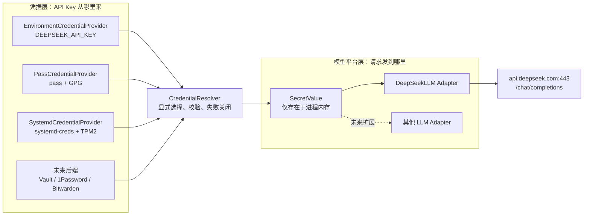
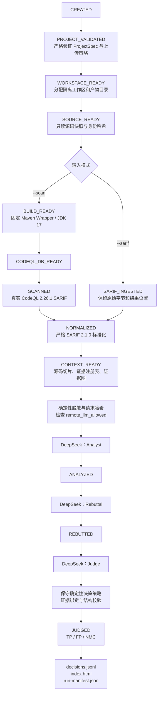

# 大模型调用、凭据边界与全流程

本文说明 EviTriage-QL 如何把 CodeQL 证据交给大模型完成二次研判，以及
如何在不把 API Key 写入仓库、命令参数或运行产物的前提下，为 WSL 和
原生 Linux 提供凭据。

## 实现状态

截至当前版本，仓库已经实现：

- `DEEPSEEK_API_KEY` 单进程环境变量；
- Linux `systemd-creds` + TPM2 加密凭据；
- WSL/原生 Linux 通用的固定 `pass` + GPG 条目；
- `CredentialProvider`/`CredentialResolver` 及固定的失败关闭选择规则；
- 固定连接 `api.deepseek.com:443/chat/completions` 的 DeepSeek V4 适配器；
- Analyst、Rebuttal、Judge 三阶段结构化调用；
- 保守的 TP、FP、NMC 决策及 JSONL/HTML 报告；
- 模型请求哈希、敏感值脱敏、严格响应模型和审计产物。

`DeepSeekLLM` 不读取环境、TPM 密文或密码库。CLI 先由凭据层选择并加载
一个经过格式校验的内存 Secret，再把它交给固定端点的模型适配器。

## 两个相互独立的接口

需要把凭据来源与模型平台分开：

1. **Credential Provider** 负责安全取得 API Key；
2. **LLM Adapter** 负责把受控请求发给指定模型平台。

多个凭据后端可以连接同一个 DeepSeek 适配器；以后增加其他模型平台时，
也可以复用同一套凭据边界。



推荐显式指定凭据来源。显式后端失败时必须停止，不能静默切换到其他
后端。`auto` 模式的固定发现顺序为：

```text
environment → systemd-creds → pass → CONFIGURATION_ERROR
```

发现顺序只处理“后端不可用”。如果已发现的凭据损坏、解密失败或格式
错误，必须失败关闭，不能继续回退。

## 完整大模型研判流程

`triage` 支持两种输入：

- `--sarif`：导入已有 SARIF；
- `--scan`：先运行真实 CodeQL，再继续研判。

两条输入分支在 SARIF 标准化后汇合，并使用相同的上下文、证据和模型
边界。



模型只参与 `CONTEXT_READY` 之后的三代理阶段。普通 `scan` 命令按设计
在 `CONTEXT_READY` 结束，不会调用大模型。

任何阶段失败都必须形成显式终态和经过脱敏的错误产物：

- `INVALID_SARIF`
- `CODEQL_FAILED`
- `CONTEXT_INCOMPLETE`
- `MODEL_FAILED`
- `POLICY_REJECTED`

## 当前可用的 WSL/Linux 调用方式

WSL 和所有普通 Linux shell 都可以使用一次性隐藏环境变量，不需要
systemd、TPM、桌面 Keyring 或明文文件：

```bash
cd /home/welen/EviTriage/EviTriage-QL
source .venv/bin/activate

(
  trap 'unset DEEPSEEK_API_KEY' EXIT
  read -rsp 'DeepSeek API Key: ' DEEPSEEK_API_KEY
  printf '\n'
  export DEEPSEEK_API_KEY

  uv run --offline evitriage triage \
    --project-config configs/projects/example-local-deepseek-v4.yaml \
    --scan \
    --llm-profile configs/llm/deepseek-v4-pro.yaml \
    --credential-provider environment \
    --json
)
```

该命令会把受控的证据项和源码片段发送给 DeepSeek，并可能产生 API
费用。专用 ProjectSpec 必须同时声明：

```yaml
security:
  source_upload_policy: remote_llm_allowed
```

API Key 不得出现在聊天、命令参数、YAML、`.env`、普通文本文件、Git、
日志或运行产物中。

## 原生 Linux TPM2 路径

具备 `systemd-creds`、TPM2 设备访问权和 `tss` 用户组的原生 Linux 可以
使用当前持久化方式：

```bash
uv run evitriage credentials set-deepseek --provider systemd-creds
uv run evitriage credentials status --json
```

当前实现固定要求 `/usr/bin/systemd-creds` 和 `--with-key=tpm2`。例如
systemd 249 的 Ubuntu 22.04 WSL 没有 `systemd-creds`，WSL 通常也没有
`/dev/tpmrm0`，因此不应把这条路径作为 WSL/Linux 的统一默认方案。

## 已实现的 WSL/Linux 持久化后端

`pass` + GPG 后端适用于 WSL 和原生 Linux：

- `pass` 将每个凭据保存为 GPG 密文；
- WSL 和原生 Linux 都可以运行 GPG/gpg-agent；
- 不依赖 systemd、TPM 或桌面 D-Bus；
- GPG 私钥必须设置口令；
- gpg-agent 可以在有限时间内缓存解锁状态。

使用界面：

```bash
pass init <your-gpg-key-id>  # 首次在 EviTriage 之外初始化密码库
evitriage credentials set-deepseek --provider pass

evitriage triage \
  --project-config configs/projects/example-local-deepseek-v4.yaml \
  --scan \
  --llm-profile configs/llm/deepseek-v4-pro.yaml \
  --credential-provider pass \
  --json
```

密码库条目固定为：

```text
evitriage/deepseek-api-key
```

实现从 `pwd` 数据库取得真实 HOME，把 `PASSWORD_STORE_DIR` 固定为
`~/.password-store`，不继承 `PASSWORD_STORE_ENABLE_EXTENSIONS`、代理、
Token 或 API Key 环境变量，只保留 GPG/pinentry 所需的受控会话变量。
`credentials status --json` 只做非解密发现，报告三个 provider 的
`available/state/reason` 以及 `selected_provider`；它不会执行 `pass
show`、systemd 解密或输出密码库/GPG 标识。

不要实现任意 `credential-command` 或任意明文文件路径；这会扩大命令
注入、路径穿越和秘密泄露边界。

## 工程落地边界

当前多凭据后端满足：

1. 定义 `CredentialProvider`/`CredentialResolver`，把凭据加载从
   `DeepSeekLLM` 中分离；
2. 保留现有 environment 和 systemd-creds 行为；
3. 新增显式的 `pass` 后端；
4. 外部命令只能使用验证后的绝对路径和参数数组，禁止 `shell=True`；
5. 严格验证 `pass` 条目名，拒绝绝对路径、`.`、`..`、空段、前导
   `-` 和 shell 元字符；
6. 使用最小环境调用 `pass`，禁用扩展，固定密码库目录；
7. 限制子进程超时、stdout/stderr 大小和 API Key 最大长度；
8. Key 只能经标准输入或内存传递，不能进入 argv、日志、异常或文件；
9. 显式 provider 失败时禁止回退，`auto` 只对不可用后端继续发现；
10. 所有测试使用受控 Fake Runner，禁止读取操作者凭据或调用真实模型。

离线测试矩阵覆盖：

- 每个后端的成功、缺失、格式错误和权限错误；
- `pass` 缺失、条目缺失、GPG 失败、超时和超大输出；
- 恶意条目名、路径穿越和 shell 元字符；
- 不可信可执行文件、符号链接和 group/world writable 文件；
- 显式选择、自动发现顺序和失败关闭；
- 日志、异常、状态输出和产物中不存在测试 Secret；
- Replay/Fake 路径永远不加载操作者凭据。

完成后至少运行：

```bash
uv sync --all-extras
make check
make security-test
make demo
uv run evitriage doctor --json
uv run evitriage credentials status --json
uv run evitriage project validate \
  --config configs/projects/example-local-deepseek-v4.yaml \
  --json
```

测试不得自动发起真实 DeepSeek 请求。真实调用只能由操作者显式授权，
并在单独的 live smoke 中执行。

## 安全边界

- 凭据保护只解决 API Key 的存储和传递，不会阻止已经授权的源码上传；
- `remote_llm_allowed` 表示允许发送受控证据，不代表内容不敏感；
- API Key 必然会短暂存在于进程内存，并由模型服务商接收；
- 同一用户权限下的恶意进程仍可能读取环境、代理进程或解锁后的秘密；
- `pass` 要求带口令保护的 GPG 私钥；无口令私钥会削弱静态保护；
- gpg-agent 的缓存期是独立安全边界，缓存未过期时同用户进程可能调用
  已解锁私钥；
- Secret Service/Python keyring 依赖桌面 D-Bus 和解锁会话，不是 WSL、
  CI、SSH 等无头环境的可靠默认；
- `pass`、TPM2 或任何本地凭据库都不构成“绝对安全”；
- 高保障部署应使用独立执行账户、最小网络权限和集中式秘密管理服务。
